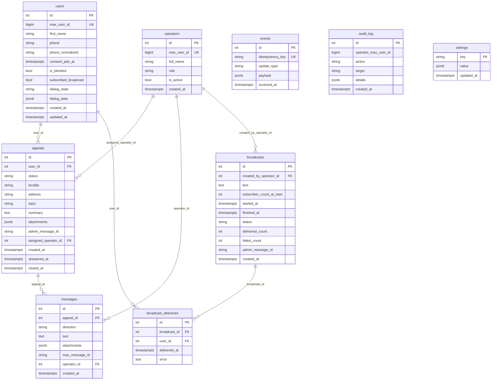
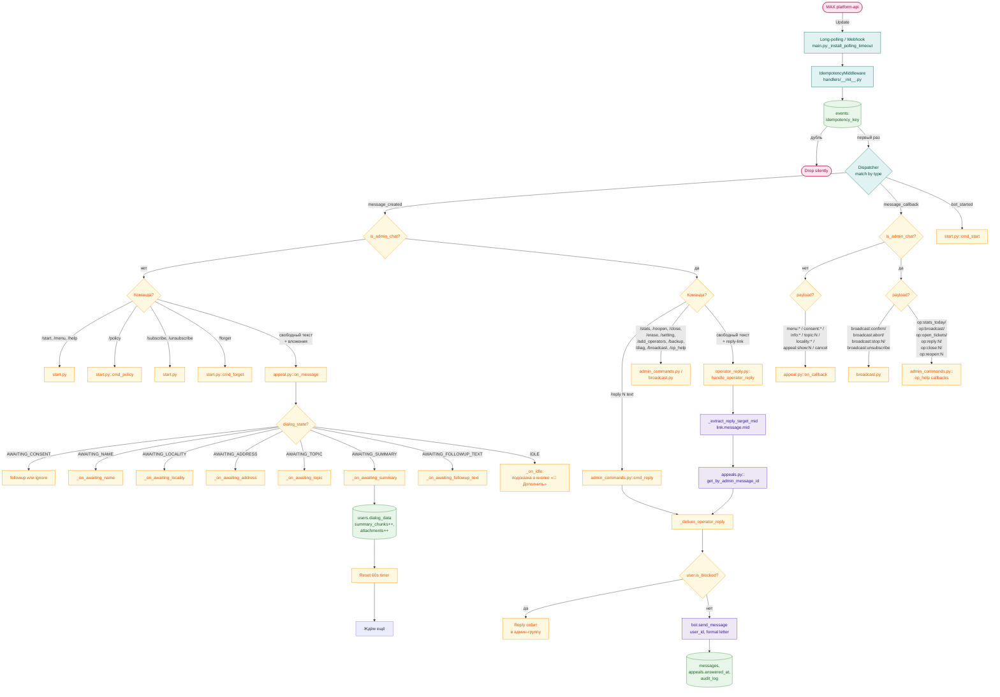
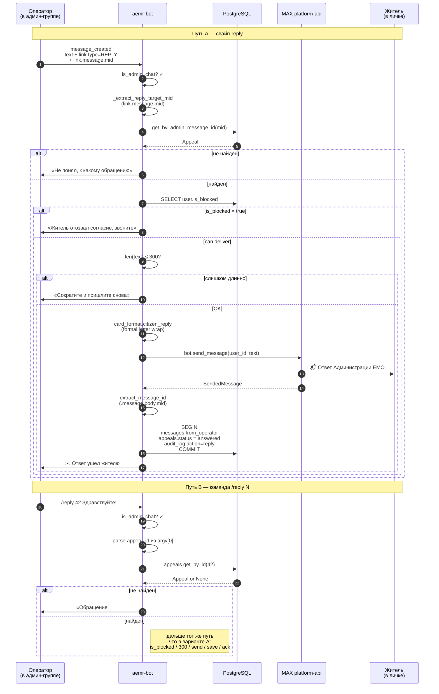
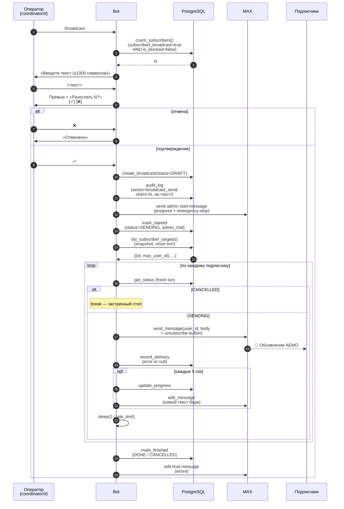
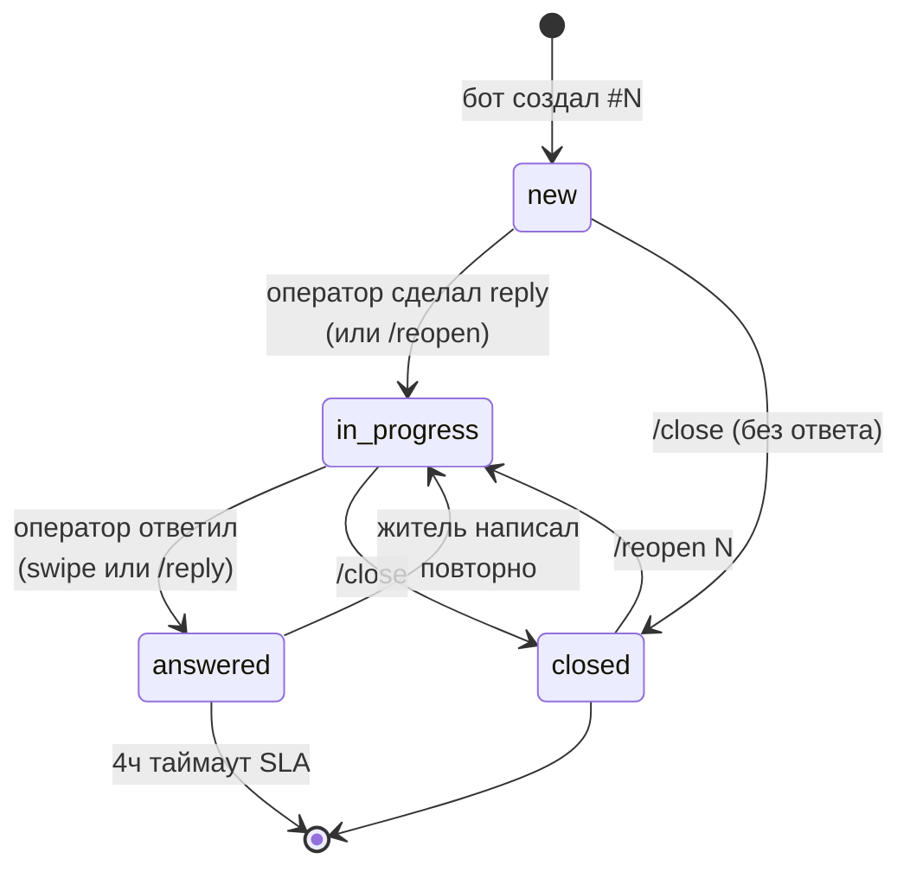
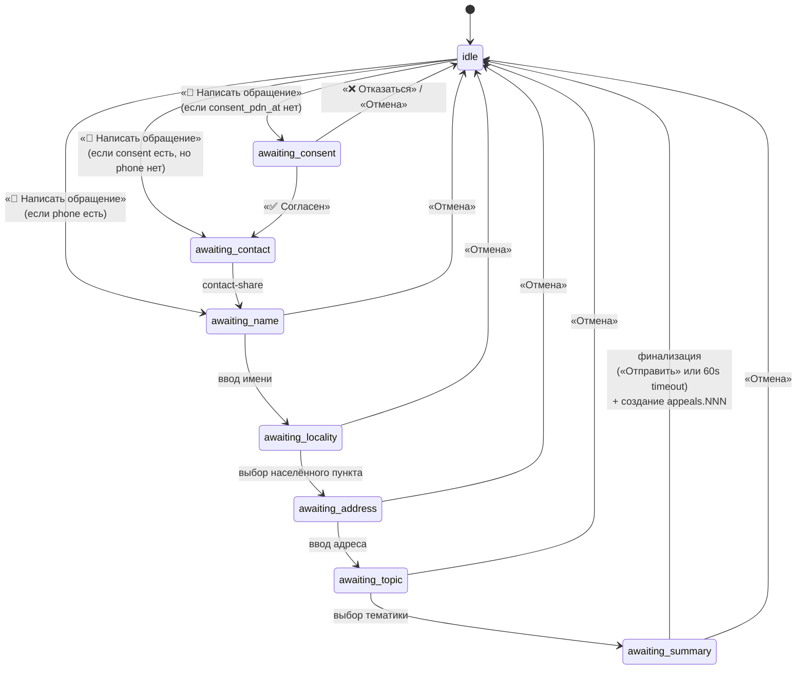
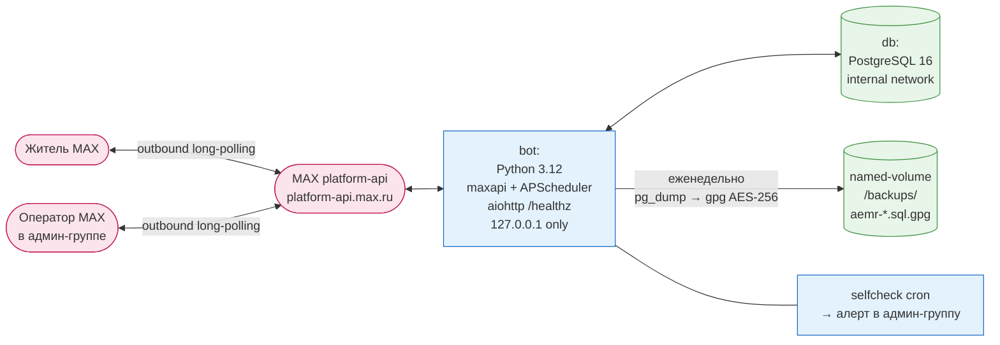

# Гайд для разработчика

Этот документ — единая точка входа для разработчика, который только что клонировал репозиторий и хочет понять, как устроен бот, как его поднять локально и где править что. Он объединяет содержимое архитектурного решения, схемы базы данных и архитектурных диаграмм. Полные источники остались на месте (`ADR-001-architecture.md`, `db-schema.md`, `architecture-diagrams.md`) — туда стоит заглядывать, если нужны исторические комментарии и обоснования; здесь — актуальный срез.

Имя пакета — `aemr_bot`, домен — `elizovomr.ru`, репозиторий — `gaben1488/aemr-bot`. Сокращение «АЕМО» в текстах бота расшифровывается как «Администрация Елизовского муниципального округа»; в коде сохраняется идентификатор `aemr_bot` по соображениям обратной совместимости и истории миграций.

## Часть I — Локальный запуск за 5 минут

Вы только что клонировали репозиторий и хотите поднять бота локально, потом внести правку и проверить, что ничего не сломалось. Этот раздел — кратчайший путь от нуля до работающего бота.

### Минимальные требования

- Windows 10/11, macOS 14+ или Linux (с Docker Desktop / docker-engine).
- **Docker Desktop** с включённым WSL2-бэкендом (для Windows). Memory не меньше 4 ГБ.
- **Git** с настроенным GitHub-доступом. Репозиторий приватный, нужен либо токен, либо SSH-ключ.
- **Python 3.12** на хосте. Нужен только для скриптов в `scripts/` и pytest. Сам бот живёт в контейнере.
- Аккаунт в мессенджере **MAX** для тестирования.

Установка Docker и WSL пошагово описаны в `docs/RUNBOOK.md` раздел 5. Здесь не дублируем.

### Шаг 1 — клонировать и подготовить .env

```bash
git clone https://github.com/gaben1488/aemr-bot.git
cd aemr-bot/infra
cp .env.example .env
```

Откройте `.env` в редакторе и заполните **только три строки** для локального теста:

```
BOT_TOKEN=<токен с max.ru/business → раздел «Боты»>
POSTGRES_PASSWORD=local-test-pass
DATABASE_URL=postgresql+asyncpg://aemr:local-test-pass@db:5432/aemr
```

Остальные параметры оставьте как есть. `BOT_MODE=polling`, `WEBHOOK_*`, `BACKUP_*`, `HEALTHCHECK_URL`, `ADMIN_GROUP_ID` пока пустые. Заполните их после первого запуска.

**Получить тестовый токен.** Откройте <https://max.ru/business>. Войдите как админ организации. Раздел «Боты» → «Создать бота» (или откройте существующего) → скопируйте Bot API token. Если у вас уже есть основной бот АЕМО, попросите у владельца сгенерировать отдельный тестовый.

### Шаг 2 — собрать и запустить

```bash
cd aemr-bot/infra
docker compose up --build bot
```

Первая сборка занимает 3–5 минут. Ставит Python-зависимости, тянет `python:3.12-slim`. Дальше пересборки занимают секунды. По окончании в логах увидите:

```
INFO  [alembic.runtime.migration] Running upgrade  -> 0001, initial schema
INFO aemr_bot.health healthcheck listening on 0.0.0.0:8080/healthz
INFO aemr_bot.services.policy policy PDF uploaded; token cached
INFO aemr_bot Starting in long polling mode
INFO dispatcher Бот: @aemo_chat_bot first_name=... id=274913354
```

Если что-то падает, откройте `docs/RUNBOOK.md` раздел «Что делать если бот молчит». Самые частые причины: тайм-аут pull от Docker Hub (повторить), забит диск (`docker system prune -a -f`), битый WSL2 (Settings → Troubleshoot → Clean / Purge data).

### Шаг 3 — поговорить с ботом

В MAX найдите своего тестового бота (production-имя — `@aemo_chat_bot`, id `274913354`) и нажмите «Старт». Должно прилететь приветствие и семь кнопок главного меню. Пройдите воронку: «📝 Написать обращение» → «✅ Согласен» (PDF приложен) → «📲 Поделиться контактом» → имя → населённый пункт → адрес → тематика → суть текстом → «Отправить». Бот ответит «Обращение #1 принято».

Чтобы карточка ушла в админ-группу, нужно настроить `ADMIN_GROUP_ID` и зарегистрировать себя как первого ИТ-оператора. Создайте в MAX группу. Добавьте туда бота. В группе напишите `/whoami`. Бот вернёт `chat_id` группы и ваш `max_user_id`. Эти числа кладёте в `.env`:

```
ADMIN_GROUP_ID=-1001234567890
BOOTSTRAP_IT_MAX_USER_ID=165729385
BOOTSTRAP_IT_FULL_NAME=Иванов И.И.
```

Перезапустите бота: `docker compose up -d --force-recreate bot`. На старте бот сам вставит запись в `operators` с ролью `it`, если её ещё нет. Теперь после прохождения воронки в группу прилетит карточка обращения. Свайп-реплай на неё — ответ пойдёт жителю. Альтернатива — команда `/reply <номер> <текст>` в группе.

## Часть II — Структура проекта

### Дерево репозитория

```
aemr-bot/
├─ bot/aemr_bot/           Python-пакет
│  ├─ main.py              точка входа, переключатель polling/webhook, recover_after_restart
│  ├─ config.py            Settings из .env (Pydantic), валидаторы
│  ├─ health.py            /healthz + Heartbeat singleton
│  ├─ texts.py             все тексты, которые отправляет бот
│  ├─ keyboards.py         inline-клавиатуры (главное меню, подменю, op_help)
│  ├─ db/
│  │  ├─ models.py         9 таблиц SQLAlchemy (см. часть IV)
│  │  ├─ session.py        async-engine, session_scope
│  │  └─ alembic/          миграции (0001_initial..0005_appeals_locality)
│  ├─ handlers/
│  │  ├─ __init__.py       register_handlers + IdempotencyMiddleware
│  │  ├─ _auth.py          ensure_operator / ensure_role / get_operator
│  │  ├─ start.py          /start, /menu, /help, /forget, /policy, /subscribe, /unsubscribe, /whoami
│  │  ├─ menu.py           главное меню, Мои обращения, подменю «Полезная информация»
│  │  ├─ appeal.py         пошаговая анкета обращения (per-user lock, _drop_user_lock)
│  │  ├─ operator_reply.py ответ через свайп и /reply, citizen-followup
│  │  ├─ broadcast.py      двухшаговый диалог /broadcast, прогресс-бар, экстренный стоп
│  │  └─ admin_commands.py /stats, /reopen, /close, /erase, /setting, /add_operators,
│  │                       /diag, /op_help, /backup, /op_help callback'и
│  ├─ services/
│  │  ├─ users.py          CRUD пользователя + операции пошаговой анкеты, find_by_phone, erase_pdn
│  │  ├─ operators.py      регистрация операторов + audit_log
│  │  ├─ appeals.py        CRUD обращений, find_active_for_user, get_by_admin_message_id
│  │  ├─ broadcasts.py     create/start/finish, deliveries, subscribers
│  │  ├─ card_format.py    форматирование карточки, обёртка официального письма для жителя
│  │  ├─ stats.py          формирование XLSX через openpyxl
│  │  ├─ policy.py         кеш токена PRIVACY.pdf, build_file_attachment
│  │  ├─ uploads.py        upload_path / upload_bytes / build AttachmentUpload
│  │  ├─ idempotency.py    отбраковка дублей Update-ов через events
│  │  ├─ settings_store.py редактируемые из админки настройки + DEFAULTS
│  │  └─ cron.py           APScheduler: db-backup, monthly-stats, healthcheck-pulse
│  └─ utils/
│     ├─ event.py          адаптер над maxapi event-объектами, is_admin_chat,
│     │                    extract_message_id, get_message_link
│     └─ attachments.py    парсинг VCF и сериализация attachments
├─ infra/
│  ├─ Dockerfile           python:3.12-slim, закреплённый по digest
│  ├─ docker-compose.yml   db + bot (+ nginx + certbot в профиле webhook)
│  ├─ nginx/feedback.conf  reverse-proxy для серверного режима связи
│  ├─ certbot/             конфиг Let's Encrypt
│  ├─ init-letsencrypt.sh  первое получение сертификата
│  └─ .env.example         шаблон со всеми ключами и комментариями
├─ seed/                   topics.json, contacts.json, transport_dispatchers.json,
│                          welcome.md, consent.md, PRIVACY.pdf
├─ scripts/
│  ├─ generate_privacy_pdf.py    повторная генерация PRIVACY.pdf из Политика.md
│  └─ reset_test_data.sql        полная зачистка тестовых данных перед prod
└─ docs/                   ADR-001, PRD-mvp, PRIVACY, SETUP, RUNBOOK, DEVELOPER, db-schema
```

### Где править что

| Хочу сделать | Файл |
|---|---|
| Изменить текст приветствия / шага анкеты / ошибки | `bot/aemr_bot/texts.py` |
| Поменять кнопки или клавиатуры | `bot/aemr_bot/keyboards.py` |
| Добавить новый шаг в анкету обращения | `bot/aemr_bot/handlers/appeal.py`. Новый state в `DialogState`, функция `_on_<state>`, строка в `_STATE_HANDLERS` |
| Добавить операторскую команду | `bot/aemr_bot/handlers/admin_commands.py` |
| Поменять контакты, расписание, ссылки | через `/setting` в админ-группе **либо** в `seed/contacts.json` (подтянется только при пустых settings) |
| Изменить лимиты или таймауты | `bot/aemr_bot/config.py` (с alias-ом для .env) и `infra/.env.example` |
| Добавить новую таблицу или поле | `bot/aemr_bot/db/models.py` + миграция через Alembic |
| Сменить версию зависимости | `bot/pyproject.toml` (compatible-release `~=`) |
| Поменять политику конфиденциальности | `docs/Политика.md` → `python scripts/generate_privacy_pdf.py` → закоммитить `docs/PRIVACY.pdf` |

## Часть III — Архитектура

### Контекст и решение в одной фразе

Администрация Елизовского муниципального округа (АЕМО, Камчатский край) хочет канал обратной связи от жителей в мессенджере MAX. Канал дополняет существующий Telegram-чат. В качестве образца взят бот «Солодов. Обратная связь» Камчатского правительства: административная панель устроена как обычный групповой чат, туда падают обращения, оператор отвечает обычным ответом на сообщение, бот пересылает ответ в личку жителю и публикует в группе подтверждение.

Управляющие ограничения проекта: только мессенджер MAX (программный интерфейс ботов на `platform-api.max.ru`), верифицированный токен юрлица АЕМО, скорость важнее перфекционизма (старт MVP за два-три рабочих дня), российский хостинг и центр обработки данных в РФ (статья 18.5 закона 152-ФЗ), четвёртый уровень защищённости персональных данных (УЗ-4 по ПП №1119, аттестация провайдера не требуется), бюджет около 1700 ₽ в месяц на хостинг.

**Решение в одной фразе.** Один сервис на Python поверх библиотеки `maxapi`. Внутри одного процесса — PostgreSQL и планировщик фоновых задач APScheduler. Связь с MAX — опросный режим (long polling: бот сам периодически спрашивает MAX о новых сообщениях). Никаких отдельных серверной части, клиентской части, мини-приложения. Административная панель — это групповой чат в MAX.

### Архитектурные блоки

**Бот.** Единственный сервис. Делает всё сам. Разговаривает с жителями в личных диалогах. Разговаривает с операторами в служебных группах. Запускает APScheduler (планировщик фоновых задач) для задач по расписанию. Ходит в базу через библиотеку SQLAlchemy.

Режим связи на старте — опросный. Преимущества для MVP: не нужен публичный HTTPS-адрес, домен и сертификат (экономия первой недели), бот разворачивается одной командой `docker compose up`, локальная разработка идёт с любой машины с интернетом. Недостаток — при простое процесса MAX держит очередь до 8 часов, дальше события теряются. Для MVP с одним работающим экземпляром это допустимо. Когда сборка стабилизируется (через две-четыре недели после публикации), переключаемся на серверный режим связи (webhook): добавляются Nginx, обычный обработчик HTTP-запросов и подписка через `POST /subscriptions`. Готовая инфраструктура серверного режима лежит в опциональном профиле `webhook` в `docker-compose`.

Защита от повторов реализована через ограничение уникальности на колонку `events.idempotency_key`. В качестве ключа берём `update_id` или комбинацию `update_type + message_id + timestamp`.

Команды бота для жителя: `/start`, `/menu`, `/help`, `/policy`, `/subscribe`, `/unsubscribe`, `/forget`, `/whoami`. Главное меню — семь inline-кнопок прямо под сообщением: «📝 Написать обращение», «📂 Мои обращения», «🔔 Подписаться/🔕 Отписаться», «🌐 Электронная приёмная» (опционально, при заполненном `electronic_reception_url`), «📋 Приём граждан», «📚 Полезная информация», «⚙️ Настройки и помощь».

Команды бота в административной группе: `/stats today|week|month` (выгрузка обращений за период в формате XLSX), `/reopen NNN`, `/close NNN`, `/op_help` (закрепляемая памятка с кнопками для операторов), `/reply N <текст>`, `/erase`, `/setting`, `/add_operators`, `/diag`, `/backup`, `/broadcast`.

**PostgreSQL.** Единое хранилище. Полный набор таблиц — в части IV. Индексы: `users.max_user_id` (уникальный), `users.phone_normalized` (после миграции 0003), `events.idempotency_key` (уникальный), `appeals.status`, `appeals.created_at`, `messages.appeal_id`, `messages.created_at`.

**Административная панель = групповой чат в MAX.** Это не отдельное приложение. Служебная группа в MAX. В неё добавлены бот и операторы.

Поток обработки обращения. Житель в личном диалоге с ботом отправляет обращение (текст с фото или геолокацией по желанию). После 60 секунд тишины (или нажатия кнопки «Отправить» в боте) обращение получает статус `new`. Бот публикует в административную группу карточку:

```
📨 Новое обращение #107
👤 Имя: Алексей
📞 Телефон: 89964240723
──────────
<текст обращения>
<фото вложением>
```

Координатор открывает карточку и **отвечает на сообщение бота через цитирование** (в MAX это обычный жест ответа на сообщение). Бот ловит событие `message_created` в административной группе с полем `link.type=reply`. По `link.message.mid` находит обращение, проверяет длину ответа (не больше 300 символов) и передаёт ответ жителю через `POST /messages?user_id=…`. После успешной доставки публикует в группе подтверждение «✉️ Ответ успешно отправлен пользователю». В БД ставится `appeals.status=answered`, `appeals.answered_at=now()`, в `messages` добавляется запись с `direction=from_operator`.

Если оператор пишет ответ длиннее 300 символов — бот возвращает в группу: «Ответ длиннее 300 символов, отредактируйте и пришлите снова». Жителю при этом ничего не уходит.

Если житель присылает следующее сообщение в обращение со статусом `answered`, бот заново открывает обращение (`status=in_progress`) и публикует новое сообщение в группе как продолжение цепочки (с цитатой исходной карточки).

**Роли** в первой итерации простые. Координатор АЕМО (отвечает на обращения, имеет доступ к `/stats`, `/reopen`, `/close`). ИТ-специалист (видит всё, плюс `/diag`, `/setting`, `/erase`, `/add_operators`, `/backup`). Специалист ЕГП по ответам — на MVP добавляется как обычный оператор в общую административную группу. Если потребуется разделение, это делается через `admin_group_id_egp` в `settings` (см. часть XI).

**Инфраструктура.** Один виртуальный сервер. Два контейнера в `docker-compose`: `bot` (Python 3.12, библиотеки `maxapi`, SQLAlchemy, APScheduler, `openpyxl`) и `db` (PostgreSQL 16, том на хосте). Никакого Nginx по умолчанию, никакого обратного прокси, никаких внешних портов наружу. Бот ходит только исходящими запросами к `platform-api.max.ru`. На сервере открыт только SSH (порт 22) для администратора. Резервное копирование — задача APScheduler раз в неделю, `pg_dump` с шифрованием через `gpg` и сохранением в named-volume `backups`.

### FSM воронка приёма обращения

Главное меню жителя — семь кнопок: «📝 Написать обращение», «📂 Мои обращения», «🔔 Подписаться/🔕 Отписаться», «🌐 Электронная приёмная» (опционально, при заполненном `electronic_reception_url`), «📋 Приём граждан», «📚 Полезная информация», «⚙️ Настройки и помощь». Согласие на обработку персональных данных запрашивается **внутри** воронки «Написать обращение», а не сразу после `/start`. Так житель может посмотреть контакты и свои прошлые обращения без согласия.

Воронка приёма работает как пошаговая анкета (конечный автомат, состояние хранится в БД в колонке `users.dialog_state`, накопленные данные — в `users.dialog_data` JSONB). Шаги:

1. **Согласие (`AWAITING_CONSENT`).** Текст политики со ссылкой и две кнопки: «✅ Согласен» и «❌ Отказаться». Шаг пропускается, если `users.consent_pdn_at IS NOT NULL`. Отказ возвращает в главное меню.
2. **Контакт (`AWAITING_CONTACT`).** Кнопка `request_contact`, телефон извлекается из вложения формата vCF. Шаг пропускается, если телефон уже есть.
3. **Имя (`AWAITING_NAME`).** Свободный ввод. Только имя, без фамилии (как в боте-образце).
4. **Населённый пункт (`AWAITING_LOCALITY`).** Выбор населённого пункта из списка поселений Елизовского МО (Елизово, Вулканный, Нагорный, Раздольный, Пиначево и так далее). Кнопками 2×N. Сохраняется в `dialog_data.locality` и впоследствии записывается в `appeals.locality` (миграция 0005).
5. **Адрес (`AWAITING_ADDRESS`).** Свободный ввод улицы и дома в выбранном населённом пункте.
6. **Тематика (`AWAITING_TOPIC`).** Кнопки прямо под сообщением, по две в ряд, из списка `settings.topics` (11 пунктов из стартового набора). Выбор пишется в `dialog_data.topic`.
7. **Суть (`AWAITING_SUMMARY`).** Свободный ввод текста плюс необязательные фото или геолокация. Каждое сообщение в этом состоянии добавляется в `dialog_data.summary_chunks` и `dialog_data.attachments`. Завершение — кнопкой «Отправить» либо автоматически по тишине в 60 секунд (`APPEAL_TIMEOUT`).
8. **Финализация.** Бот создаёт `appeals.NNN` со структурированными полями `locality/address/topic/summary/attachments`, публикует карточку в административной группе (формат идентичен карточке в «Мои обращения»), сохраняет `appeals.admin_message_id` для последующих обновлений, обнуляет состояние анкеты (`dialog_state = idle`), отвечает жителю «Обращение #N принято, ответим в течение 4 рабочих часов».

После ответа оператора (через цитирование в группе) и доставки жителю обращение получает статус `answered`. Если житель пишет в состоянии `idle` новое сообщение, и у него есть активное обращение со статусом `answered`, бот открывает его заново (`status = in_progress`) и публикует в группе сообщение-продолжение с цитатой исходной карточки.

На любом шаге воронки доступна кнопка «Отмена». Она обнуляет состояние анкеты и возвращает жителя в главное меню без сохранения.

### Защита от гонок при финализации обращения

Функция `_persist_and_dispatch_appeal` обёрнута в блокировку на пользователя (`asyncio.Lock`, словарь `_user_locks: dict[int, asyncio.Lock]`). Это защищает от двойного клика по «Отправить», от гонки между срабатыванием таймера и нажатием «Отправить», от гонки между отменой и срабатыванием таймера. Внутри блокировки делается проверка на повтор по полю `user.dialog_state == IDLE`. Второй параллельный вызов после успешной финализации первого видит состояние `IDLE` и выходит без создания дубля обращения и карточки. Реализация рассчитана только на один экземпляр сервиса. Горизонтальное масштабирование (более одного контейнера бота) сломает эту схему. Для развёртывания с несколькими экземплярами понадобится `pg_advisory_xact_lock` или блокировка на основе Redis.

`_drop_user_lock` удаляет блокировку после завершения, чтобы dict не рос неограниченно.

### Жёсткие пределы пользовательского ввода

| Параметр | По умолчанию | Назначение |
|---|---|---|
| `SUMMARY_MAX_CHARS` | 2000 | Предел на суммарную длину `summary_chunks`. Оставляет запас внутри карточки в административной группе на 4000 символов |
| `ATTACHMENTS_MAX_PER_APPEAL` | 20 | Предел числа вложений на одно обращение. Сверх лимита — тихий отброс с записью в журнал уровня `info` |
| `ATTACHMENTS_PER_RELAY_MESSAGE` | 10 | Размер пакета для пересылки. Обходит недокументированный серверный лимит MAX |
| `VCF_INFO_MAX_CHARS` | 10000 | Предел на разбор поля `vcf_info` в `extract_phone`. Защита от вредоносного контакта на несколько мегабайт |

Все параметры настраиваются через переменные окружения через `Field(alias=...)` в `config.py`.

**Лимит ответа оператора — 300 символов.** Жёсткий лимит в программном интерфейсе бота. При попытке отправить более длинный ответ — отказ с сообщением в административной группе. Без модального окна и без автоматической разбивки. Так упрощается интерфейс, оператор сам решает, что делать. Обоснование цифры — в требованиях куратора (200–300). Берём верхнюю границу, чтобы не ломать стандартные шаблоны на 250–280 символов из `agent_export/operator_templates.json`.

### Постраничный вывод в «Мои обращения»

Список обращений жителя выводится по 5 на страницу с кнопками навигации `⬅️ N/M ➡️`. В каждой строке — значок статуса, текстовый статус («Новое», «В работе», «Завершено», «Закрыто без ответа»), дата и первые 32 символа сути обращения. Обработчик нажатия `appeals:page:N` живёт в `handlers/menu.py::handle_callback`. Размер страницы — константа `MY_APPEALS_PAGE_SIZE = 5`.

### Защита потока жителя в административной группе

Команды `/start`, `/menu`, `/help`, `/policy`, `/forget`, `/subscribe`, `/unsubscribe` и нажатия кнопок из меню жителя (согласие, тема, информация, отмена) молча игнорируются, если событие пришло из `ADMIN_GROUP_ID`. Реализовано через функцию `is_admin_chat(event)` в `utils/event.py` и проверки в `handlers/start.py` плюс ранний контроль в `handlers/appeal.on_callback`. Без этого оператор, по привычке набравший `/start` в административной группе, получал бы приветственное меню. Его `max_user_id` создавал бы запись в `users`, и оператор мог бы застрять в состоянии `AWAITING_CONSENT`.

### Безопасность и соответствие 152-ФЗ

Класс информационной системы персональных данных — **УЗ-4** по ПП №1119: категория ПДн «иные» (имя, телефон, текст обращений, фото и геолокация в качестве вложений), тип угроз — третий, число субъектов — менее 100 000, категория субъектов — не сотрудники оператора.

Обязательные меры. Хранение данных на территории РФ (статья 18.5 закона 152-ФЗ), сервер в Москве или Санкт-Петербурге. Согласие пользователя на обработку ПДн при первом взаимодействии (фиксация в `users.consent_pdn_at`). Публикация политики на сайте АЕМО со ссылкой из бота, текст лежит в `docs/Политика.md`. АЕМО зарегистрирована в реестре операторов ПДн Роскомнадзора. Базовая гигиена ИБ на сервере: межсетевой экран `ufw`, доступ по SSH-ключам, отключение входа под `root`, `fail2ban`, `unattended-upgrades`, шифрование резервных копий через `gpg`.

Не требуется для УЗ-4: аттестация провайдера, средства криптографической защиты, аттестация информационной системы ПДн, расширенная модель угроз.

**Удаление по запросу.** Команда `/erase max_user_id=NNN` или `/erase phone=+7...` от ИТ-специалиста в административной группе. Либо текстовая команда жителя `/forget`. Алгоритм: `users.first_name='Удалено'`, `users.phone=NULL`, `users.phone_normalized=NULL`, `users.consent_pdn_at=NULL`, сброс состояния анкеты, `is_blocked=true`, `subscribed_broadcast=false`, запись в журнал действий. Удаление завершается за минуту, в пределах 24 часов, как требует закон.

### Эксплуатационные компоненты

**Проверка живости.** Файл `bot/aemr_bot/health.py` поднимает HTTP-сервер на основе `aiohttp` на порту `WEBHOOK_PORT` (по умолчанию 8080) с обработчиком `/healthz`. В `docker-compose` порт публикуется на `127.0.0.1:8080`. Это нужно только для локальной проверки живости контейнера. Наружу `/healthz` не выставляется (модель самостоятельного хостинга, никаких входящих портов). Внутри — единый объект `Heartbeat` обновляется фоновой задачей `heartbeat_pulse` каждые `HEALTHCHECK_PULSE_SECONDS`. Если основной цикл завис, сигнал жизни перестаёт обновляться, и `/healthz` отдаёт 503 после `HEALTHCHECK_STALE_SECONDS`. Эндпоинт также проверяет БД через `SELECT 1`. Если у администратора есть собственный сборщик состояния внутри корпоративной сети, можно настроить исходящий пинг на `HEALTHCHECK_URL`.

**Защита от повторов — обязательный слой.** Функция `services/idempotency.py::claim` строит ключ из `update_type`, `callback_id`, `mid`, `seq`, `timestamp`, `chat`, `user`. Делает `INSERT ON CONFLICT DO NOTHING` в таблицу `events` и возвращает True или False. Подключается через внешний промежуточный слой `IdempotencyMiddleware` в `handlers/__init__.py::register_handlers` и срабатывает на каждое обновление до любого обработчика. Дубликаты от MAX (редкие в опросном режиме, частые при повторных доставках в серверном режиме) молча отбрасываются на уровне ограничения уникальности `events.idempotency_key`. Без этого слоя переход на webhook дал бы дубли карточек в административной группе.

**Восстановление зависших анкет.** Функция `handlers/appeal.py::recover_stuck_funnels` запускается через `asyncio.create_task` при старте, не блокирует диспетчер. Через `users_service.find_stuck_in_summary(idle_seconds)` находит пользователей в состоянии `AWAITING_SUMMARY`, у которых `updated_at` старше таймаута. Параллельно через `asyncio.gather` финализирует их обращения. Пустые отправки (нет ни текста, ни вложений) сбрасываются в `IDLE`, чтобы не зацикливаться. Пакетное восстановление ограничено: `RECOVER_BATCH_SIZE=1000`. Это защита от патологии — 10 тысяч застрявших воронок после многочасового простоя дали бы 10 тысяч вызовов программного интерфейса при старте.

**Тайм-аут опросного режима.** Параметр `POLLING_TIMEOUT_SECONDS` (по умолчанию `30`, диапазон `0..90`) задаёт **серверное** время ожидания вызова `getUpdates` в MAX. Это сколько MAX держит соединение, ожидая событий. Это не интервал между запросами клиента. Опросный режим возвращает ответ либо при появлении события, либо по истечении этого времени. Чем выше значение — тем меньше пустых обращений в простое (важно при ограничении частоты в 2 запроса в секунду на бота, действующем с 11 мая 2026 года), и тем медленнее реакция на остановку. Реализация — подмена связанного метода `bot.get_updates` в `main.py::_install_polling_timeout`, потому что `maxapi.Dispatcher.start_polling` не пробрасывает параметр времени ожидания внутрь. Если когда-то понадобится свой форк `maxapi`, это первый кандидат на запрос изменений.

**Зависимость maxapi.** Остаёмся на `love-apples/maxapi` через ограничение версий `~=0.6` (compatible release).

| Репозиторий | Тип | Активность | Звёзды |
|---|---|---|---|
| `love-apples/maxapi` | сообщество | активно обновляется (последний коммит — апрель 2026) | 166+ |
| `max-messenger/max-botapi-python` | официальный форк предыдущего | заморожен на ревизии `2025-07-30` | 54 |
| `green-api/max-api-client-python` | через шлюз green-api.com | требует подписку | — |

Официальный форк — снимок исходного репозитория девятимесячной давности, переход означал бы откат с потерей исправлений после июля 2025 (включая то, что мы используем для `process_update_webhook`, `TypeAdapter[Attachments]`, `MessageLinkType`). `green-api` создаёт зависимость от внешнего платного сервиса. Решение о собственном форке — только при трёх и более месяцах без коммитов и открытых критических задачах либо при незакрытой уязвимости в течение 14 дней. Ежеквартальная проверка активности — задача координатора.

**Хранилище состояний анкеты — Postgres JSONB, не Redis.** Активных воронок одновременно — десятки в часы пик, единицы ночью. Пиковая нагрузка 1–2 операции UPDATE в секунду. Postgres проглатывает не замечая. Триггер пересмотра — устойчивые показатели свыше 500 одновременных воронок по `/diag`.

## Часть IV — База данных

Полный канонический срез лежит в `db-schema.md`. Здесь — то, что нужно знать разработчику в момент работы.

### ER-диаграмма



### Таблицы по назначению

| Таблица | Назначение | Срок хранения |
|---|---|---|
| `users` | Житель. Профиль, состояние пошаговой анкеты, флаги `is_blocked` и `subscribed_broadcast`, нормализованный телефон. | Бессрочно. Обезличивание через `/forget` или `/erase`. |
| `operators` | Оператор. `max_user_id`, ФИО, роль (`coordinator`, `aemr`, `egp`, `it`), активность. | Бессрочно. |
| `appeals` | Обращение. Одно обращение — одна строка с номером `#N`. Структурированные поля `locality/address/topic/summary/attachments`. | Бессрочно. |
| `messages` | История сообщений внутри обращения (житель, оператор, system). | Бессрочно. |
| `events` | Журнал сырых обновлений (Update) от MAX. Нужен для защиты от повторов и для отладки. | Автоматическая очистка раз в сутки удаляет записи старше 30 дней. |
| `audit_log` | Журнал действий операторов: ответ, закрытие, удаление ПДн, изменение настроек. | Бессрочно. |
| `settings` | Параметры, редактируемые прямо в БД (адрес электронной приёмной, расписание, контакты, тематики, тексты, токен PDF политики). | Бессрочно. |
| `broadcasts` | Метаданные рассылок: текст, кто отправил, счётчики, статус. | Бессрочно. |
| `broadcast_deliveries` | Одна строка на каждую попытку доставки (житель × рассылка). | Бессрочно. |

### Ключевые инварианты

- `users.max_user_id` уникален в пределах платформы MAX. На него опирается поиск жителя при следующем `/start`. Дубликатов не возникает.
- `events.idempotency_key` уникален. Это основа защиты от повторных обновлений. Дубликат тихо отбрасывается на уровне ограничения уникальности.
- `appeals.admin_message_id` — идентификатор сообщения карточки обращения в служебной группе. По нему функция `handle_operator_reply` находит обращение, на которое отвечает оператор свайпом или командой `/reply`. До момента публикации карточки поле равно NULL.
- `users.dialog_state` хранится как `String(32)`. Значения берутся из перечисления `DialogState` в коде. Перевод в тип `Enum` базы PostgreSQL — одно из возможных направлений развития. Для MVP оставили строкой ради скорости миграций при добавлении новых состояний.
- `appeals.attachments` и `messages.attachments` — массивы JSONB с сериализованными вложениями MAX. При пересылке в служебную группу они восстанавливаются в Pydantic-объекты `Attachments` через `TypeAdapter`.
- `appeals.locality` появилось миграцией 0005. Может быть NULL для исторических обращений, заполнялось до неё на основе текстового адреса. Новые обращения всегда содержат значение.
- Подписчики рассылки определяются условием `users.subscribed_broadcast=true AND users.is_blocked=false`. После `/erase` оба флага переключаются (`subscribed_broadcast=false`, `is_blocked=true`). Это исключает повторные сообщения жителю без нового согласия.
- `broadcasts.subscriber_count_at_start` — снимок количества получателей на момент старта рассылки. Нужен для прогресс-бара и итогового расчёта «доставлено + не доставлено». В ходе рассылки не пересчитывается.
- `users.phone_normalized` синхронно поддерживается через `services/users.set_phone`. Прямой `UPDATE users SET phone=...` в обход сервисного слоя ломает инвариант.

### Подключение к живой БД

```bash
# Открыть psql внутри контейнера db. Удобно для разовых запросов.
docker compose exec db psql -U aemr -d aemr

# Один SQL без захода в интерактивный режим.
docker compose exec db psql -U aemr -d aemr -c "SELECT count(*) FROM appeals;"

# Подключиться с хоста через DBeaver / IntelliJ Database Tools.
# Сначала выпустить порт наружу, поправив docker-compose.yml:
#   db:
#     ports: ["127.0.0.1:5432:5432"]
# Хост: 127.0.0.1, порт 5432, БД aemr, пользователь aemr, пароль из .env.
# В прод не публикуем — только на dev-стенде.
```

### Состояние схемы

```bash
# Текущая версия миграции
docker compose exec bot alembic current
# Ожидание: 0005 или новее

# История ревизий
docker compose exec bot alembic history --verbose

# Список таблиц
docker compose exec db psql -U aemr -d aemr -c "\dt"

# Описание конкретной таблицы (колонки, типы, индексы)
docker compose exec db psql -U aemr -d aemr -c "\d+ appeals"

# Все индексы
docker compose exec db psql -U aemr -d aemr -c "\di"

# Текущий пользователь, БД, версия Postgres
docker compose exec db psql -U aemr -d aemr -c "SELECT current_user, current_database(), version();"
```

### Очистка тестовых данных

В репозитории лежит готовый скрипт `scripts/reset_test_data.sql`. Он удаляет обращения, сообщения, события, рассылки, журнал действий и пользователей-жителей. Сохраняет только `operators`, `settings` и схему. Подходит на тестовом стенде между прогонами smoke-тестов.

```bash
# Запуск с хоста (Linux/macOS)
cat scripts/reset_test_data.sql | docker compose exec -T db psql -U aemr -d aemr

# То же из PowerShell
Get-Content scripts/reset_test_data.sql | docker compose exec -T db psql -U aemr -d aemr
```

**Не запускайте в production.** В скрипте нет защиты «вы уверены». Выполнили — удалили реальные обращения.

Если нужна жёсткая очистка только одной таблицы (например, после стресс-теста рассылки):

```bash
docker compose exec db psql -U aemr -d aemr -c "TRUNCATE broadcast_deliveries, broadcasts CASCADE;"
docker compose exec db psql -U aemr -d aemr -c "TRUNCATE events;"
```

`TRUNCATE` быстрее, чем `DELETE`. Сбрасывает счётчик `id`. Уважает CASCADE.

### Полное пересоздание базы

```bash
cd ~/aemr-bot/infra
docker compose down -v   # ключ -v снесёт volume db_data вместе с контейнером
docker compose up -d --build
# Контейнер db инициализируется заново. Alembic в стартовой команде бота
# прогонит все миграции с нуля и создаст пустую схему.
```

Полезно, когда состояние схемы не совпадает с миграциями (откатывали миграцию вручную, что-то сломалось); нужна гарантированно чистая БД для воспроизведения бага; сменили `POSTGRES_PASSWORD` после первого старта (см. [COMMANDS.md §10а](COMMANDS.md)). **Все данные пропадут.** На production — только после успешного бэкапа.

### Просмотр содержимого таблиц

```sql
-- Все жители за последние сутки
SELECT id, max_user_id, first_name, phone, dialog_state, created_at
FROM users
WHERE created_at > now() - interval '1 day'
ORDER BY id DESC;

-- Открытые обращения
SELECT id, user_id, status, locality, address, topic, created_at
FROM appeals
WHERE status IN ('new', 'in_progress')
ORDER BY created_at;

-- Сообщения по конкретному обращению
SELECT direction, text, created_at
FROM messages
WHERE appeal_id = 42
ORDER BY created_at;

-- Последние 50 действий операторов
SELECT created_at, operator_max_user_id, action, target, details
FROM audit_log
ORDER BY id DESC LIMIT 50;

-- Счётчики по статусам обращений
SELECT status, count(*) FROM appeals GROUP BY status;

-- Топ-5 жителей по числу обращений
SELECT u.max_user_id, u.first_name, count(a.id) AS appeals
FROM users u JOIN appeals a ON a.user_id = u.id
GROUP BY u.id ORDER BY appeals DESC LIMIT 5;

-- Подписчики рассылки
SELECT count(*) FROM users
WHERE subscribed_broadcast = true AND is_blocked = false;
```

### Точечные правки данных

```sql
-- Сменить роль оператора (бот эту операцию не умеет — защита от
-- самоповышения, см. handlers/admin_commands.py::cmd_add_operators).
UPDATE operators SET role='it' WHERE max_user_id=165729385;

-- Деактивировать оператора (мягкое удаление).
UPDATE operators SET is_active=false WHERE max_user_id=165729385;

-- Принудительно закрыть зависшее обращение.
UPDATE appeals SET status='closed', closed_at=now() WHERE id=42;

-- Отвязать обращение от оператора (при увольнении).
UPDATE appeals SET assigned_operator_id=NULL WHERE assigned_operator_id=<op_id>;

-- Сбросить состояние воронки у конкретного жителя
-- (обычно срабатывает само при рестарте через recover_stuck_funnels).
UPDATE users SET dialog_state='idle', dialog_data='{}'::jsonb
WHERE max_user_id=165729385;

-- Снять флаг is_blocked, если поставили по ошибке.
UPDATE users SET is_blocked=false WHERE max_user_id=165729385;
```

После любой ручной правки `users.dialog_data` или `appeals.attachments` (это JSONB-поля) убедитесь, что данные валидны — приложение читает их через Pydantic-модели и упадёт на битом JSON.

### Частые проблемы и как их чинить

**`InvalidPasswordError: password authentication failed for user "aemr"`.** Подробный разбор и два варианта починки — в [COMMANDS.md §10а](COMMANDS.md). Кратко: при первом запуске `POSTGRES_PASSWORD` записывается в данные тома и больше не перечитывается. После ротации пароля либо снести том (`docker compose down -v`), либо сделать `ALTER USER` в живой БД.

**`alembic.util.exc.CommandError: Can't locate revision identified by '0005'`.** Файл миграции есть, а ревизия не найдена. Скорее всего, приложили миграцию из ветки, которая ещё не была вмержена. Откат: переключиться на нужную ветку и сделать `alembic upgrade head`.

**`sqlalchemy.exc.OperationalError: ... ssl negotiation packet`.** Бот пытается подключиться к Postgres до того, как контейнер `db` стал готов. В compose это закрывается параметром `depends_on.condition: service_healthy`. Если ошибка повторяется, проверьте здоровье `db`: `docker compose ps`. У сервиса должен быть статус `healthy`. Если нет — `docker compose logs --tail=100 db`.

**`Table 'X' doesn't exist` или `column 'Y' does not exist`.** Не накатили миграцию. Запустите `docker compose exec bot alembic upgrade head` и проверьте `alembic current`.

**Расхождение моделей и миграций.**
```bash
docker compose exec bot alembic check
# Если ругается «Target database is not up to date» — нужны новые миграции.
```

**Рост `events`.** Таблица пишется на каждый Update от MAX. При высоком трафике может разрастись. Автоматическая чистка раз в сутки удаляет записи старше 30 дней (см. `services/cron.py::events_retention`). Если задача не отрабатывает, проверьте логи: `docker compose logs bot | grep events`.

**Долгий запрос подвисает.**
```sql
SELECT pid, now()-query_start AS dur, left(query,120)
FROM pg_stat_activity
WHERE state='active' AND now()-query_start > interval '30 seconds';

-- Прервать запрос
SELECT pg_cancel_backend(<pid>);
-- Если не помогло — жёстко
SELECT pg_terminate_backend(<pid>);
```

**Раздутие таблицы (bloat).**
```sql
VACUUM (ANALYZE, VERBOSE) events;
VACUUM (ANALYZE, VERBOSE) broadcast_deliveries;
```

**JSONB не индексируется.** В коде по полям `users.dialog_data`, `appeals.attachments`, `audit_log.details` мы не ищем — только читаем по PK/FK. GIN-индексы не нужны. Если добавляете запрос `WHERE attachments @> '...'`, сначала добавьте индекс отдельной миграцией.

**`ix_users_phone_normalized` не используется.** После миграции 0003 поиск по телефону идёт по этому индексу. Если `find_by_phone` всё ещё медленный, проверьте, что `phone_normalized` заполняется. Все вставки и обновления `phone` должны идти через `services/users.set_phone`.

### Смена пароля БД (ротация на живой системе)

```bash
# 1. На живой БД сменить пароль на новый.
docker compose exec db psql -U aemr -c "ALTER USER aemr WITH PASSWORD '<новый>';"
# 2. Подставить новое значение в .env (одинаково в POSTGRES_PASSWORD и в DATABASE_URL).
# 3. docker compose up -d --force-recreate bot
```

### Резервное копирование и восстановление

Полностью описано в [COMMANDS.md §5–§6](COMMANDS.md) и в [RUNBOOK.md §7](RUNBOOK.md). Тут — короткий ориентир:

- Бэкапы лежат в named-volume `infra_backups`, путь внутри контейнера — `/backups/`.
- Имя файла: `aemr-YYYYMMDD_HHMMSS.sql.gpg` если задан `BACKUP_GPG_PASSPHRASE`, иначе `.sql`.
- Снять бэкап вручную: `/backup` в админ-группе MAX (доступно роли `it`).
- Восстановить — `gpg --decrypt ... | psql -U aemr -d aemr`.

При разработке миграций **всегда** прогоняйте проверочное восстановление на тестовом стенде до коммита: «миграция, которую не пробовали откатывать, может однажды не откатиться».

## Часть V — Архитектурные диаграммы

Полный набор схем — здесь же в этом разделе. Все диаграммы написаны на Mermaid; GitHub отрисовывает их в браузере.

### 1. Жизненный цикл обращения (нотация BPMN)

Один путь от первого `/start` жителя до закрытия обращения координатором.

```mermaid
flowchart TD
    classDef citizen fill:#e1f5ff,stroke:#0288d1,color:#01579b
    classDef bot fill:#f3e5f5,stroke:#7b1fa2,color:#4a148c
    classDef operator fill:#fff3e0,stroke:#f57c00,color:#e65100
    classDef db fill:#e8f5e9,stroke:#388e3c,color:#1b5e20
    classDef terminal fill:#ffebee,stroke:#c62828,color:#b71c1c

    Start([Житель открывает бота]):::citizen
    Welcome[Бот: приветствие<br/>7 кнопок главного меню]:::bot
    BtnAppeal{«📝 Написать<br/>обращение»?}:::citizen

    Start --> Welcome
    Welcome --> BtnAppeal

    BtnAppeal -->|нет| OtherFlow[Мои обращения / подписка /<br/>электронная приёмная /<br/>приём граждан / полезная<br/>информация / настройки]:::bot
    BtnAppeal -->|да| ConsentCheck{consent_pdn_at<br/>уже стоит?}:::bot

    OtherFlow --> EndOther([Возврат в меню]):::terminal

    ConsentCheck -->|нет| Consent[Бот: текст согласия<br/>+ PDF политики ПДн]:::bot
    Consent --> ConsentChoice{«✅ Согласен» /<br/>«❌ Отказаться»?}:::citizen
    ConsentChoice -->|отказ| EndDecline([Возврат в меню]):::terminal
    ConsentChoice -->|согласие| SaveConsent[(users.consent_pdn_at = now)]:::db

    ConsentCheck -->|да| ContactCheck
    SaveConsent --> ContactCheck{phone уже<br/>сохранён?}:::bot

    ContactCheck -->|нет| AskContact[Бот: запрос контакта<br/>через RequestContactButton]:::bot
    AskContact --> ShareContact[Житель: «📲 Поделиться<br/>контактом»]:::citizen
    ShareContact --> SaveContact[(users.phone,<br/>users.first_name)]:::db

    ContactCheck -->|да| AskName
    SaveContact --> AskName[Бот: запрос имени]:::bot

    AskName --> InputName[Житель вводит имя]:::citizen
    InputName --> AskLocality[Бот: 11+ населённых<br/>пунктов клавиатурой 2×N]:::bot
    AskLocality --> ChooseLocality[Житель выбирает<br/>населённый пункт]:::citizen
    ChooseLocality --> AskAddress[Бот: запрос адреса<br/>улица + дом]:::bot
    AskAddress --> InputAddress[Житель вводит адрес]:::citizen
    InputAddress --> AskTopic[Бот: 11 тематик<br/>клавиатурой 2×N]:::bot
    AskTopic --> ChooseTopic[Житель выбирает]:::citizen
    ChooseTopic --> AskSummary[Бот: «Опишите суть.<br/>Можно фото, гео»]:::bot

    AskSummary --> InputSummary[Житель: текст / фото / гео<br/>несколько сообщений]:::citizen
    InputSummary --> Trigger{Кнопка «Отправить»<br/>или 60 сек тишины?}:::bot
    Trigger -->|ещё пишет| InputSummary

    Trigger -->|финализация| CreateAppeal[(appeals.status = new<br/>locality, address, topic, summary,<br/>attachments JSONB)]:::db
    CreateAppeal --> AdminCard[Бот → админ-группа:<br/>📨 Новое обращение #N<br/>+ reply'ом фото]:::bot
    AdminCard --> AckCitizen[Бот → житель:<br/>«Обращение #N принято»]:::bot

    AdminCard --> WaitOp{Оператор отвечает?}:::operator

    WaitOp -->|свайп-reply| ParseReplyLink[link.message.mid →<br/>get_by_admin_message_id]:::bot
    WaitOp -->|/reply N text| ParseCommand[parse appeal_id<br/>из аргумента]:::bot
    WaitOp -->|/close N| CloseSilently[(appeals.status = closed,<br/>closed_at = now)]:::db
    WaitOp -->|таймаут SLA| AlertSLA[/⚠️ Предупреждение в группу/]:::bot

    ParseReplyLink --> ValidateLen{len ≤ 300?}:::bot
    ParseCommand --> ValidateLen
    ValidateLen -->|нет| TooLong[Бот: «Сократите<br/>и пришлите снова»]:::bot
    TooLong --> WaitOp

    ValidateLen -->|да| CheckBlocked{user.is_blocked?}:::bot
    CheckBlocked -->|да| BlockedReply[Бот: «Житель отозвал<br/>согласие — звоните»]:::bot
    BlockedReply --> WaitOp

    CheckBlocked -->|нет| DeliverReply[Бот → жителю:<br/>📬 формальное письмо<br/>от АЕМО]:::bot
    DeliverReply --> SaveAnswered[(appeals.status = answered,<br/>answered_at = now,<br/>messages from_operator)]:::db
    SaveAnswered --> ConfirmGroup[Бот → группа:<br/>✉️ Ответ ушёл]:::bot

    ConfirmGroup --> WaitFollowup{Житель пишет<br/>повторно?}:::citizen
    WaitFollowup -->|нет, 4 ч| EndAnswered([Закрытие по таймауту]):::terminal
    WaitFollowup -->|да| ReopenAppeal[(appeals.status =<br/>in_progress)]:::db
    ReopenAppeal --> FollowupCard[Бот → группа:<br/>💬 Дополнение к #N]:::bot
    FollowupCard --> WaitOp

    CloseSilently --> EndClosed([Закрыто без ответа]):::terminal
    AlertSLA --> WaitOp
```



**Что не показано на схеме.** Восстановление застрявших анкет (`recover_stuck_funnels` при старте бота находит жителей, застрявших в шаге сбора текста, и завершает их обращения параллельно основному потоку). Команды `/erase` и `/forget` — обезличивание ставит `is_blocked=true`, после чего ветка «Бот → жителю» блокируется на проверке `CheckBlocked`. Промежуточный слой защиты от повторов — между событием от MAX и любым обработчиком стоит `IdempotencyMiddleware`, любой прямоугольник «Житель» или «Оператор» неявно отбрасывает дубль обновления через ограничение уникальности `events.idempotency_key`.

### 2. Поток события: от MAX до записи в БД



### 3. Диаграмма последовательности: доставка ответа оператора

Два пути от текста, написанного оператором, до личного диалога жителя. Различие — как находится номер обращения (`appeal_id`).



### 4. Диаграмма последовательности: рассылка `/broadcast`



### 5. Состояния обращения



Переход из состояния `answered` в финальное сейчас не автоматический. Обращение остаётся в `answered` до явного действия. Либо житель пишет повторно, либо оператор закрывает командой `/close`, либо ничего не происходит. Автоматическое истечение срока ответа в коде не реализовано. В команде `/stats` есть только метрика «попадание в срок».

### 6. Состояния пошаговой анкеты жителя



При старте бота функция `recover_stuck_funnels` находит всех жителей в состоянии `awaiting_summary`, у которых поле `updated_at` старше `APPEAL_TIMEOUT`. Завершает их обращения и возвращает в состояние `idle`.

### 7. Схема развёртывания



Размещение на собственном сервере. Опросный режим связи. Бот делает **только исходящие** запросы на `platform-api.max.ru`. Ни один входящий порт наружу не публикуется. Адрес `/healthz` слушает только `127.0.0.1:8080` — это нужно для проверки здоровья контейнера в Docker Compose. База данных доступна только во внутренней сети Docker. Загрузка резервных копий в S3-хранилище опциональна и тоже исходящая. Стек серверного режима связи (nginx + certbot) лежит в дополнительном профиле Docker Compose `webhook` на случай будущего перехода. **В производственной сборке он не используется.**

## Часть VI — Рассылка по подписчикам

Реализованная возможность. Координатор АЕМО объявляет о чрезвычайных ситуациях, публичных слушаниях, плановых работах коммунальных служб через одну команду в административной группе. Решение появилось из запроса «нужна возможность разослать важное объявление всем подписавшимся».

### Согласие

Подписка явная (житель сам нажимает «🔔 Подписаться» в главном меню или в подменю «Полезная информация» либо пишет `/subscribe`). Это отдельное согласие на обработку данных в целях информирования, рядом с согласием на обработку ПДн в воронке обращения. Без подписки житель не получит ни одной рассылки.

По закону 38-ФЗ «О рекламе» муниципальное информирование рекламой не является (это не коммерческое продвижение). Поэтому отдельной формальной галочки «согласен на рекламу» не требуется. Подписка через кнопку — это согласие на конкретный канал коммуникации, не на персональные данные.

В каждом сообщении рассылки есть кнопка «🔕 Отписаться от рассылки». Однократное нажатие переключает флаг `users.subscribed_broadcast = false`. Команда `/unsubscribe` делает то же самое.

### Технический контур

- Таблица `broadcasts`: `id`, `created_by_operator_id`, `text`, `subscriber_count_at_start`, `started_at`, `finished_at`, `status` (`draft`, `sending`, `done`, `cancelled`, `failed`), `delivered_count`, `failed_count`, `admin_message_id`.
- Таблица `broadcast_deliveries`: `id`, `broadcast_id`, `user_id`, `delivered_at`, `error`.
- Поле `users.subscribed_broadcast` (булево, по умолчанию `false`).
- Команда `/broadcast` в административной группе — двухшаговая анкета. Бот запрашивает текст (предел 1000 символов), показывает предпросмотр с числом подписчиков, ждёт подтверждения. На «✅ Разослать» создаётся запись в `broadcasts`, запускается фоновая задача через `asyncio.create_task`.
- Рассылка асинхронная. Ограничение скорости — 1 сообщение в секунду (`BROADCAST_RATE_LIMIT_PER_SEC`). Это вписывается в лимит MAX в 2 запроса в секунду. На 1000 подписчиков рассылка идёт около 17 минут.
- Состояние анкеты-рассылки хранится в памяти процесса (`_wizards: dict[int, _WizardState]`) с временем жизни 300 секунд. Реализация рассчитана только на один экземпляр сервиса. Горизонтальное масштабирование сломает её.

### Интерфейс жителя

```
📢 Объявление от Администрации Елизовского муниципального округа

<текст рассылки>

[ 🔕 Отписаться от рассылки ]
```

Кнопка отписки — `payload="broadcast:unsubscribe"`. Бот ставит флаг и шлёт «Подписка отключена. Вернуть — командой /subscribe.»

### Интерфейс оператора

В административной группе после команды `/broadcast` и подтверждения появляется сообщение прогресса:

```
Рассылка #5 запущена.
⏳ 0/47

[ ⛔ Экстренно остановить ]
```

Каждые 5 секунд бот обновляет это же сообщение через `bot.edit_message`: счётчик доставленных, число упавших. По завершении — итоговое «✅ Рассылка #5 завершена. Доставлено: 46. Не доставлено: 1.» Кнопка «⛔ Экстренно остановить» доступна **любому оператору в группе**. Это страховка на случай скомпрометированной учётной записи координатора.

Шаг прогресс-бара адаптивный: `min(progress_update_sec, estimated_total / 10)`. На короткой рассылке бар обновляется чаще, на длинной — реже, чтобы уложиться в ограничение скорости edit-запросов в MAX.

### Команды

- `/broadcast` — создать рассылку (анкета).
- `/broadcast list` — последние 10 рассылок со статусами и счётчиками.

Доступ — `coordinator` и `it`. Рядовым `aemr` и `egp` команда недоступна.

### Защита и фильтры

- Каждая рассылка пишется в журнал действий с полным текстом и инициатором (`action=broadcast_send`).
- Заблокированные ботом жители (`is_blocked=true`) и анонимизированные через `/erase` или `/forget` (`first_name='Удалено'`) исключаются из списка получателей автоматически.
- Предел длины текста рассылки — 1000 символов (`BROADCAST_MAX_CHARS`). Длинные объявления имеет смысл публиковать на сайте АЕМО, а в рассылку давать краткую выжимку со ссылкой.
- Рассылку можно остановить кнопкой «⛔». Фоновая задача проверяет флаг между каждой отправкой и прерывается.

### Пересылка вложений в административную группу

Фото, видео, геолокация и файлы из обращения пересылаются в административную группу вторым сообщением (после текстовой карточки). Сообщение привязывается к карточке через `NewMessageLink(type=REPLY, mid=admin_card_mid)`. Сохранённые в `appeals.attachments` (JSONB) словари десериализуются обратно в pydantic-модели через `TypeAdapter(Attachments)` из библиотеки `maxapi` и передаются в `bot.send_message(attachments=[...])`. Контактные вложения исключены: телефон уже в карточке, дублировать ПДн не нужно. Каждое сообщение с вложениями ограничено `ATTACHMENTS_PER_RELAY_MESSAGE=10`. Партии пронумерованы «(2/3)» и так далее для удобства чтения.

## Часть VII — Миграции базы данных

Миграции — это изменения схемы БД с версионностью. Управляет ими Alembic.

```bash
# Сгенерировать новую миграцию из изменений в models.py
docker compose exec bot alembic revision --autogenerate -m "describe what changed"

# Накатить
docker compose exec bot alembic upgrade head

# Откатить на одну
docker compose exec bot alembic downgrade -1
```

После генерации **обязательно прочитайте файл миграции**. Автоматическая генерация иногда ошибается с типами JSONB и enum-полями. Файл попадает в `bot/aemr_bot/db/alembic/versions/`.

### Текущий список миграций

| Версия | Файл | Что добавила |
|---|---|---|
| 0001 | `0001_initial.py` | Начальная схема: `users`, `operators`, `appeals`, `messages`, `events`, `audit_log`, `settings` |
| 0002 | `0002_broadcast.py` | Таблицы `broadcasts`, `broadcast_deliveries`, поле `users.subscribed_broadcast` |
| 0003 | `0003_phone_normalized.py` | Колонка `users.phone_normalized` и индекс `ix_users_phone_normalized` для O(log n)-поиска по телефону. `services/users.set_phone` синхронно поддерживает её |
| 0004 | `0004_indexes_and_autovacuum.py` | Дополнительные индексы и параметры autovacuum для часто пишущихся таблиц (`events`, `broadcast_deliveries`) |
| 0005 | `0005_appeals_locality.py` | Колонка `appeals.locality` под выбор населённого пункта в воронке (шаг `AWAITING_LOCALITY` между именем и адресом) |

Каждое изменение моделей фиксируется новой миграцией. Текущую версию в БД проверяет команда `alembic current` внутри контейнера:

```bash
docker compose exec bot alembic current
docker compose exec bot alembic upgrade head
```

При разработке миграций **всегда** прогоняйте проверочное восстановление на тестовом стенде до коммита.

## Часть VIII — Тесты и стиль кода

### Тесты

```bash
# Локально на хосте (нужен pip install -e ".[dev]" внутри bot/)
cd bot
pytest tests/ -v
```

Сейчас в `tests/` лежат тесты на сервисный слой. Они **не работают на in-memory SQLite** из-за PostgreSQL-specific JSONB. Если нужно гонять, поднимайте локальный Postgres и подменяйте `DATABASE_URL`. Альтернатива — подключить `testcontainers`. Это известное направление развития, см. часть XI.

Тесты на старте — `pytest` для сервисного слоя бота с заглушкой `maxapi.Bot`. Проверяем сценарии: согласие → запрос контакта → меню; приём обращения с серией сообщений; ответ оператора цитированием; отказ при ответе длиннее 300 символов; статистика за период; удаление ПДн.

При добавлении новой логики пишите тесты в той же папке. Покрывать: бизнес-сценарии, граничные случаи, пути с проверками безопасности (роли, валидаторы, лимиты).

### Стиль кода

- Python 3.12, type hints везде где возможно.
- `ruff` для линта (конфиг в `pyproject.toml`, line-length 100).
- Не пишем комментарии, объясняющие что делает код. Имена переменных уже это говорят. Пишем только зачем: невидимые ограничения, тонкие инварианты, ссылки на документацию.
- Импорты сверху файла. Импорты внутри функций оправданы только при честных циклических зависимостях.
- Никогда не обращайтесь к `event.chat_id` или `event.user.user_id` напрямую. Всегда через `utils/event.py::get_chat_id` или `get_user_id`. Структуры событий в `maxapi` неоднородны, адаптер их сглаживает.

### Рабочий цикл

1. Создайте ветку: `git checkout -b feat/your-thing`.
2. Внесите правки.
3. Прогон тестов и ручная проверка через docker compose.
4. Коммит сообщением в формате `feat:` / `fix:` / `refactor:` / `docs:` / `chore:`.
5. Push в `origin`. Откройте PR на `main` через `gh pr create`.
6. После одобрения — squash merge в `main`. На сервере: `git pull && docker compose up -d --build bot && docker compose exec bot alembic upgrade head`.

### Развёртывание

На MVP без автоматической сборки и доставки. Развёртывание ручное:

```bash
ssh feedback@<vps>
cd ~/aemr-bot
git pull
docker compose up -d --build
docker compose exec bot alembic upgrade head
```

Когда сборка стабилизируется, добавим минимальный сценарий в GitHub Actions с прогоном тестов и `docker compose pull && up -d` через SSH.

## Часть IX — Известные особенности maxapi

`love-apples/maxapi` — Python-библиотека от сообщества для работы с Bot API мессенджера MAX. Удобна, но местами протекает. Модели не покрывают все поля сервера. Имена полей не совпадают с документацией. Некоторые методы возвращают объекты, которых нет в типизации. Ниже грабли, на которые мы наступали. Оставлены здесь, чтобы на них больше никто не наступал.

**1. `Message.link.message.mid`, не `Message.link.mid`.** Когда оператор делает свайп-реплай в админ-группе, в событии приходит `Message.link: LinkedMessage`. Сам `link.mid` пустой. Идентификатор исходного сообщения лежит на один уровень глубже, в `link.message.mid` (внутри вложенного `MessageBody`). Смотрите `_extract_reply_target_mid` и `_mid_from_link` в `handlers/operator_reply.py`. На отдельных версиях клиента pydantic-обёртка превращается в dict. Отсюда двойная попытка чтения.

**2. `bot.send_message(...)` возвращает `SendedMessage`, не `Message`.** У результата нет `.message_id` напрямую. Идентификатор лежит в `result.message.body.mid`. Адаптер `extract_message_id` в `utils/event.py` снимает оба варианта (через цепочку `getattr`) и работает на None-входе тоже. Используется при сохранении `appeals.admin_message_id` и `messages.max_message_id`.

**3. `upload_file` возвращает `AttachmentUpload`, а не плоский dict.** Старая ревизия `maxapi` отдавала `dict`. Текущая отдаёт pydantic-модель. Для отправки в `attachments=[...]` сериализуйте через `.model_dump(by_alias=True)` или конкретные конструкторы (`PhotoAttachment`, `FileAttachment`). См. `services/uploads.py` и `services/policy.py::build_file_attachment`.

**4. Порядок регистрации хендлеров важен.** Диспетчер берёт первый совпавший. Если зарегистрировать `message_created` без фильтра раньше, чем `message_created(Command(...))`, команда не сработает. Все универсальные обработчики регистрируются в `handlers/appeal.py` последними. Команды и callback'и — раньше. Любая правка `register_handlers` в `handlers/__init__.py` требует прогнать проверочный прогон из админ-группы.

**5. Защита потока жителя через `is_admin_chat`.** Обработчики, рассчитанные на жителя (`/start`, главное меню, «Написать обращение»), оборачиваются в `if is_admin_chat(event): return` на уровне регистрации. Иначе оператор, написавший в служебной группе, попадёт в анкету как «житель». Получит приветственное меню и заведётся в `users`. Шаблон вынесен в `utils/event.py::is_admin_chat`.

**6. Защита от повторов через `events.idempotency_key`.** MAX иногда повторно шлёт один и тот же Update (например, при повторном запросе после таймаута). `IdempotencyMiddleware` (промежуточный слой обработки) пишет в `events` уникальный ключ (`update_id` или комбинация полей) и пропускает дубликат. Любое новое поле, способное менять обработку, надо включать в ключ. Иначе тихо потеряем сообщение.

**7. Восстановление застрявших сессий пошаговой анкеты.** Пошаговая анкета — это конечный автомат, она же FSM. Если бот рестартанул в середине анкеты, `dialog_state` пользователя застывает. На старте `recover_after_restart` пробегает по застрявшим сессиям пачками (`RECOVER_BATCH_SIZE`) и шлёт жителю «Бот перезапустился, давайте начнём сначала», обнуляет состояние. Без этого житель будет навсегда залипать в `AWAITING_SUMMARY`.

**8. Отладочный дамп `event.message`.** Когда что-то идёт не так с парсингом события (новые типы вложений, изменение схемы maxapi после релиза), включайте `LOG_LEVEL=DEBUG`. Диспетчер пишет полный pydantic-дамп. Раньше дампили вручную через `log.info(repr(event.message))`. Не делайте так в production-логах — ПДн утекут в журнал.

**9. Блокировка на пользователя в `appeal.py`.** Два сообщения от одного жителя за миллисекунды (свайп с фото и текст) могут параллельно изменить `dialog_data`. `_user_locks: dict[int, asyncio.Lock]` сериализует обработку на уровне пользователя. `_drop_user_lock` удаляет блокировку после завершения, чтобы dict не рос неограниченно.

**10. Тайм-аут опросного режима связи.** `POLLING_TIMEOUT_SECONDS=30` — это серверный timeout `getUpdates`, не интервал между запросами. Чем выше значение, тем меньше пустых обращений к API, когда никто ничего не пишет. Потолок MAX — 90 секунд. На 0 бот будет хлестать API на 2 RPS ограничение скорости и кончит свой бюджет за минуты.

## Часть X — Известные ограничения и направления оптимизации

Список вещей, которые работают, но при росте нагрузки или объёма данных могут дать о себе знать. Каждый пункт — фиксация осознанного выбора «не сейчас», с триггером, при котором имеет смысл вернуться, и эскизом решения. На MVP с десятками подписчиков и тысячами обращений в год ни один из них не блокирует запуск.

**1. `_run_broadcast_impl` открывает три `session_scope` на каждого получателя.** В `handlers/broadcast.py` цикл отправки тратит транзакцию на проверку статуса (флаг отмены), отдельную — на запись `broadcast_deliveries`, и ещё одну — на периодический `update_progress`. На текущем масштабе (десятки подписчиков, около одной рассылки в неделю) это копейка: суммарный overhead — единицы миллисекунд. **Триггер для фикса:** устойчиво больше 1000 подписчиков или несколько одновременных рассылок. **Как чинить:** батчевать `record_delivery` пачками по 50, статус-флаг проверять не каждую итерацию, а раз в N сообщений. Альтернатива — вынести запись доставок в фоновую таску с очередью.

**2. `handlers/appeal.py::on_callback` — длинная if-цепочка.** Около 200 строк ветвлений по `payload`-префиксам (`menu:`, `consent:`, `info:`, `topic:`, `locality:`, `appeal:show:`, `cancel`, `appeals:page:`). Читается линейно и не тормозит. Но добавлять новый callback приходится в общую кучу. **Триггер для фикса:** появление 5+ новых callback'ов или необходимость промежуточного слоя обработки на каждый payload. **Как чинить:** вытащить в dict `{prefix: handler_fn}` с делегированием, по образцу `_STATE_HANDLERS` в том же файле. Чистый рефакторинг, без изменения поведения.

**3. `_run_broadcast_impl` — около 140 строк, плоская функция.** Содержит и подготовку (заголовок в админ-группу), и main-loop, и финализацию (mark_finished, отчёт). Можно вынести `_post_broadcast_header`, `_send_loop`, `_finalize_broadcast` в отдельные функции. Читаемость улучшится. Сейчас читается линейно сверху вниз и не имеет глубоких ветвлений, поэтому терпимо. **Триггер для фикса:** добавление перед- или после-обработки (например, проверка квоты на оператора, фильтрация подписчиков по тематике).

**4. Анонимные `_(event)` обработчики в `handlers/start.py` и других файлах.** Декораторы `@dp.message_created(Command(...))` оборачивают функции с именем `_`. Удобно для регистрации (одна строка), но в стектрейсе вместо `cmd_start` будет `start.<locals>._`. **Триггер для фикса:** ловля сложного бага с непонятным происхождением. **Как чинить:** именовать каждую функцию по команде (`cmd_start_handler`, `cmd_help_handler` и так далее) и вешать декоратор поверх.

**5. `_user_locks` живёт в памяти процесса и не разделяется между инстансами.** `dict[int, asyncio.Lock]` в памяти бота. При запуске нескольких реплик гонки между инстансами не закрываются. На MVP — один инстанс, это нормально. **Триггер для фикса:** переход на multi-replica deployment. **Как чинить:** advisory-locks Postgres (`pg_advisory_xact_lock(max_user_id)`) внутри `session_scope` или распределённый Redis-lock.

**6. `services/policy.py::ensure_uploaded` грузит PDF при каждом старте, если токен не закеширован.** `policy_pdf_token` хранится в `settings`. Но при первой инсталляции (или после `/setting policy_pdf_token "" `) PDF загружается заново. На каждый старт это секунда лишнего ввода-вывода, копейки. **Триггер для фикса:** требование быстрой новой установки (например, проверка живости в Kubernetes).

**7. Inline русские строки в `handlers/admin_commands.py` (usage-сообщения).** Около десятка коротких подсказок типа «Используйте: /reopen <номер>» лежат прямо в коде, а не в `texts.py`. Это технические строки для оператора, не отображаются жителю. **Триггер для фикса:** третья ревизия операторских команд или появление i18n. **Как чинить:** константы `OP_USAGE_*` в `texts.py`. Сейчас оставлено для локальности — usage и парсинг аргументов читаются вместе.

### Что было в этом списке и закрыто

Несколько ограничений из ранних версий MVP исправлены и теперь не считаются ограничениями.

- **`find_by_phone` full-table scan.** Закрыто миграцией `0003_phone_normalized`. Добавлена индексированная колонка `users.phone_normalized`. `set_phone` и `erase_pdn` поддерживают её в синхронизации. Поиск теперь O(log n) по индексу.
- **`cmd_stats` и `run_stats_today` дублировали обвязку XLSX.** Закрыто общим хелпером `_send_stats_xlsx(event, period, target_chat_id)` в `handlers/admin_commands.py`. Оба пути делегируют ему.
- **Таблица `events` без авто-чистки.** Закрыто APScheduler-job'ом `events_retention` в `services/cron.py`. Ежедневно в 04:00 удаляет записи старше 30 дней.
- **Фиксированный шаг прогресс-бара рассылки.** Закрыто адаптивной формулой `min(progress_update_sec, estimated_total / 10)` в `_run_broadcast_impl`. На короткой рассылке бар обновляется чаще, на длинной — реже, чтобы уложиться в ограничение скорости edit-запросов в MAX.
- **Молчаливый сбой бэкапа.** Закрыто обёрткой `backup_with_alert`. Еженедельный pg_dump, упавший в воскресенье ночью, утром всплывает алертом в админ-группу.
- **`/healthz` отдавал OK при зависшей БД.** Закрыто SELECT 1 в обработчике `/healthz`. Endpoint теперь даёт 503, если БД недоступна, даже когда heartbeat свежий.
- **Bot-контейнер запускался как root, без read-only fs, без resource limits.** Закрыто в `infra/Dockerfile` и `docker-compose.yml`: непривилегированный пользователь `botuser` (UID 1000), `read_only: true`, `tmpfs:/tmp`, `mem_limit: 512m`, `pids_limit: 200`, `cap_drop: ALL`, `no-new-privileges`. Compose-блок `healthcheck` добавлен.
- **Мёртвые экспорты `iter_subscribers`, `is_operator`.** Удалены. Заменены на `list_subscriber_targets` и `_auth.get_operator` соответственно.
- **`/diag` отдавал минимум метрик.** Расширено: жители (всего, подписаны, заблокированы), обращения (всего, в работе), рассылки (✅ done, ⚠️ failed), события (всего, последнее), плюс конфиг.
- **Шаг «Населённый пункт» в воронке.** Добавлен миграцией 0005 (`appeals.locality`). До этого населённый пункт пользователь записывал текстом в адрес, что ломало последующую маршрутизацию по поселениям.

## Часть XI — Перспективы

Идеи, которые рассматривались, но не вошли в производственный периметр MVP. Без сроков и плановых обозначений. Это перспективы, а не отложенные задачи. Если в будущем появится конкретный сценарий или потребность, каждая из них обсуждается отдельно и реализуется как новый блок поверх текущей архитектуры.

### Расширения механизма рассылок

- **Шаблоны рассылок.** Заготовленные тексты «ЧС», «праздник», «работы», чтобы координатор не писал каждое объявление с нуля.
- **Планирование на будущее.** Команда `/broadcast schedule «завтра в 10:00»` для постановки в очередь.
- **Сегментация подписчиков.** Рассылка только в определённое поселение (на основе `appeals.locality` и подписки), по тематикам или по адресу.
- **Загрузка резервной копии в S3.** Облачное резервное копирование как дополнение к локальному. Инфраструктура в коде уже есть (поля `BACKUP_S3_*`). Если в будущем потребуется, нужна настройка под конкретное хранилище и ключи.

### Маршрутизация и роли операторов

- **Маршрутизация обращений по адресу.** Жители, попадающие в Елизовское ГП, направляются операторам с ролью `egp`, остальные — в АЕМО. Шаблон таблицы поселений с улицами и индексами уже есть в `RUNBOOK.md`. Реализация имеет смысл, если сотрудник ЕГП устанет видеть в общей ленте обращения не из своего поселения. После миграции 0005 это становится тривиальным — есть готовое поле `appeals.locality`.
- **Разделение ролей внутри одной группы.** Сейчас все авторизованные считаются операторами с одинаковым набором команд (кроме `/erase`, `/setting`, `/add_operators`, `/broadcast`). Гранулярные роли могли бы ограничить, например, кто закрывает обращения, а кто только отвечает.
- **Адресные сигналы для ИТ в личку.** Если бот падает или резервная копия не сделана, отправлять сигнал не только в административную группу, но и в личку конкретному ИТ-специалисту.

### Качество ответов и помощь оператору

- **Автоматический проверщик против Стандарта качества АЕМО.** Подсветка нарушений пунктов 5, 6, 9, 11 (страдательный залог, канцелярит, лишние восклицательные знаки, многоточия) при нажатии «Отправить ответ». Не блокирующая, рекомендательная.
- **Помощник оператору на основе языковой модели** («перепиши короче, мягче, по чек-листу»). На MVP отказались. Оператор отвечает живым языком, без посредника на основе ИИ.
- **Подсказки шаблонов ответа** оператору. Файл JSON примерно с тридцатью шаблонами от прошлого анализа Telegram-чата лежит в `telegram_analytics/agent_export/` как образец.
- **Автоматическая классификация тематик** обращения. Жители выбирают тематику из списка вручную. Машинное обучение для классификации сэкономило бы шаг, но не критично.

### Инфраструктура

- **Серверный режим связи** вместо опросного. Готовая инфраструктура (Nginx, утилита Let's Encrypt, обработчик `/max/webhook` с проверкой секрета) лежит в опциональном профиле `webhook` в `docker-compose`. Переключение — `BOT_MODE=webhook` и подъём профиля. Имеет смысл при росте нагрузки или при введении в MAX более жёстких лимитов на опросный режим.
- **Свой форк `love-apples/maxapi`.** Сейчас исходный репозиторий активный (последний коммит — апрель 2026). Условия для форка: три и более месяцев без активности и при этом открыты критические задачи; либо уязвимость безопасности без реакции мейнтейнера в течение 14 дней. При срабатывании — форк в `gaben1488/maxapi` под контролем муниципалитета.
- **Точечное восстановление БД (PITR, point-in-time recovery).** Сейчас `pg_dump` работает раз в неделю. PITR через архивирование журнала упреждающей записи (WAL — Write-Ahead Log) в S3 даёт восстановление на любую секунду между резервными копиями. Цена — постоянная отправка WAL-файлов в облако. Имеет смысл после значимого роста объёма данных.
- **Управляемый Postgres** вместо самостоятельного хостинга. Гипотетически снимает с нас резервные копии, мониторинг и обновления версий. Но входит в противоречие с принятой моделью самостоятельного хостинга у заказчика и не рассматривается без отдельного решения АЕМО.
- **`testcontainers` для тестов сервисного слоя.** Сейчас тесты не работают на in-memory SQLite (PostgreSQL-specific JSONB). Локальный Postgres на CI через `testcontainers` снимет ограничение и даст быстрый зелёный прогон в pull request.

### Аналитика

- **Дашборды и графики.** Когда наберётся примерно 200–300 обращений, имеет смысл собрать одноразовый HTML-дашборд с разбивкой по тематикам, операторам и времени отклика. Шаблон есть в `telegram_analytics/`.
- **Многоязычие.** Идея интересная, но для муниципального сервиса потребность не очевидна — все жители Елизовского округа говорят по-русски.

### Что меняется при изменении вводных

- Безопасник АЕМО требует аттестации хостинга. Тогда пересматриваем серверное окружение в рамках самостоятельного хостинга (другая стойка, другая конфигурация ОС). Облачные провайдеры в этом проекте не используются.
- Куратор хочет жёсткое разделение АЕМО и ЕГП. Тогда создаём вторую административную группу. В таблице `settings` указываем `admin_group_id_egp`. Добавляем правило маршрутизации в `settings.egp_keywords` (ключевые слова темы ЕГП) или используем `appeals.locality`.
- Появятся новые подписки и тематические рассылки. Тогда добавляем поля `consent_chs`, `consent_events` в `users`. Это чистая надстройка, ломать MVP не понадобится.
- Бот вырастает до федеральных функций (приём обращений по 59-ФЗ). Тогда пересматриваем уровень защищённости и провайдера.

## Полезные ссылки

- Bot API MAX: [`dev.max.ru/docs/chatbots`](https://dev.max.ru/docs/chatbots)
- Исходники `maxapi` (Python-библиотека от сообщества): [`github.com/love-apples/maxapi`](https://github.com/love-apples/maxapi)
- Официальные клиенты MAX: [`github.com/max-messenger`](https://github.com/max-messenger)
- Реестр операторов ПДн (Роскомнадзор): [`pd.rkn.gov.ru/operators-registry`](https://pd.rkn.gov.ru/operators-registry)
- Закон 152-ФЗ «О персональных данных»: [`consultant.ru/document/cons_doc_LAW_61801`](https://www.consultant.ru/document/cons_doc_LAW_61801/)

### Дальнейшее чтение

- `docs/ADR-001-architecture.md` — архитектурное решение и его уточнения после первичной реализации (исторический контекст и обоснования).
- `docs/PRD-mvp.md` — функциональные требования (v6 — production-ready).
- `docs/SETUP.md` — пошаговая настройка админ-группы и регистрация операторов.
- `docs/RUNBOOK.md` — операционная инструкция координатору и ИТ.
- `docs/architecture-diagrams.md` — исходный набор BPMN, flowchart и sequence-диаграмм.
- `docs/db-schema.md` — каноническая схема базы и инварианты.
- `docs/Политика.md` — текст политики ПДн.
- `docs/COMMANDS.md` — полная шпаргалка эксплуатационных команд.
