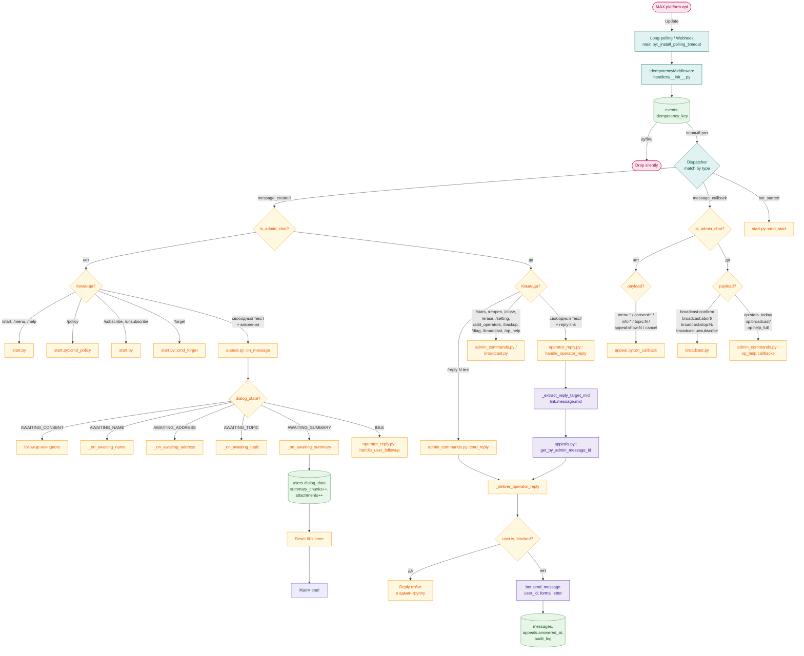
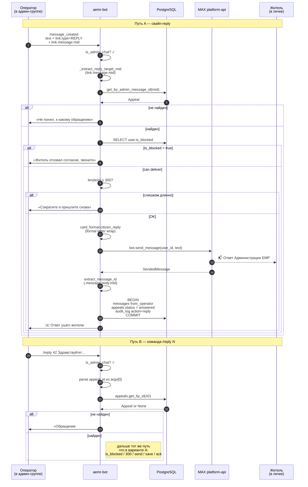
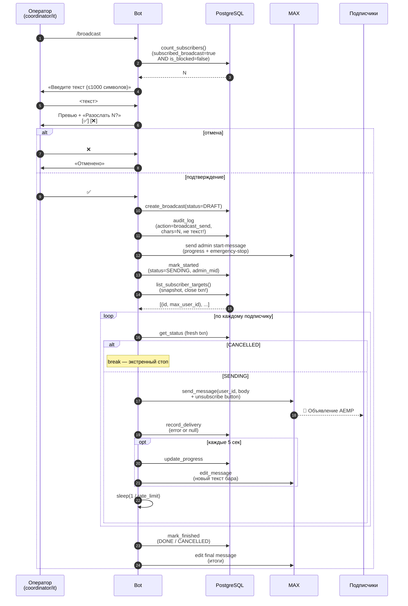
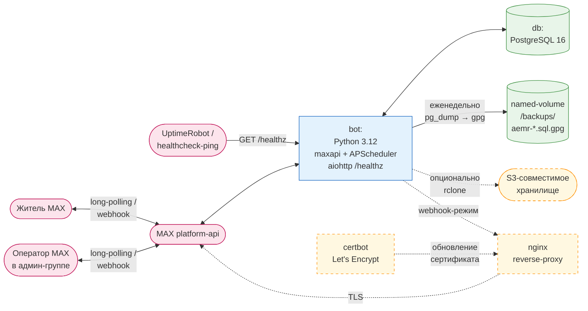
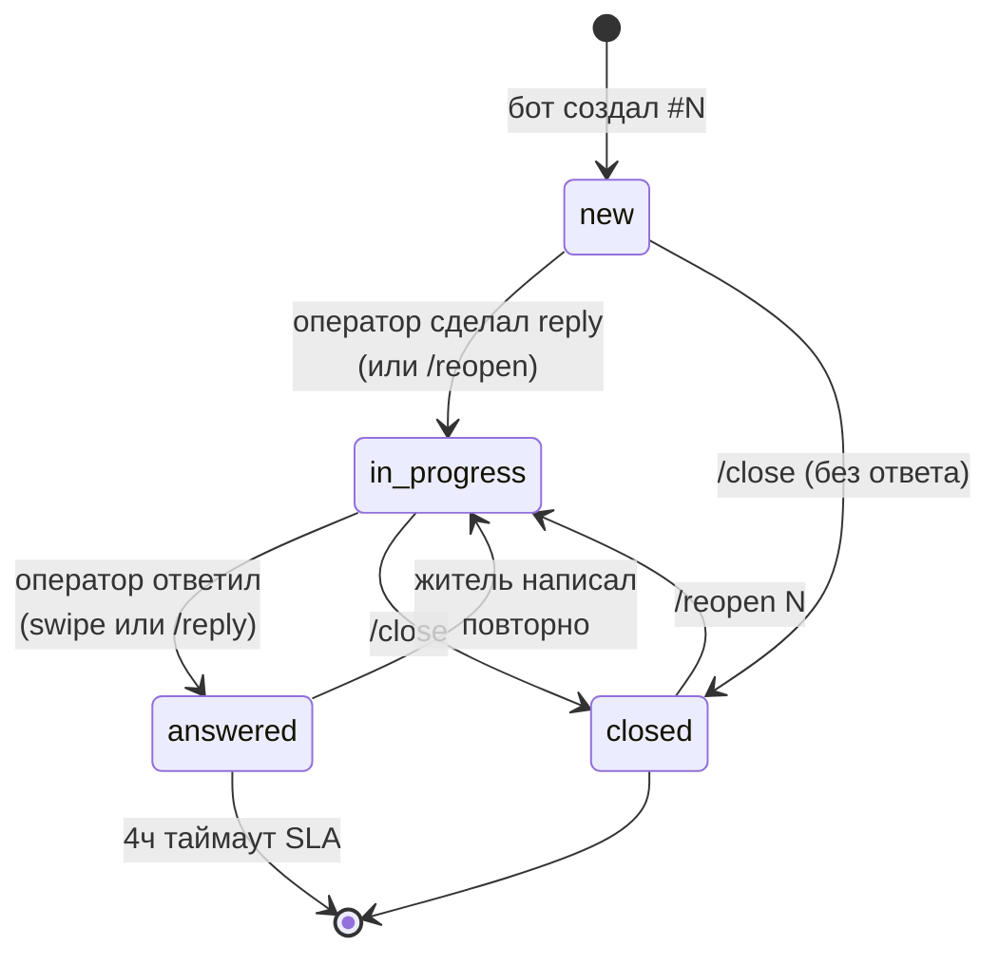
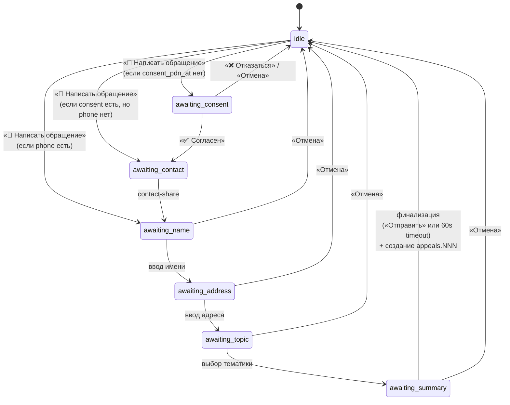

# Архитектурные диаграммы

Визуализация ключевых процессов и структуры кода aemr-bot. Все диаграммы — Mermaid; рендерятся прямо на GitHub. ER-схема живёт в [db-schema.md](db-schema.md), здесь оставлена ссылка для целостности.

## 1. Жизненный цикл обращения (BPMN-style)

Один путь от первого `/start` жителя до закрытия обращения координатором. BPMN-нотация в Mermaid передаётся через `flowchart` с разделением на дорожки (lanes — `subgraph`).

```mermaid
flowchart TD
    classDef citizen fill:#e1f5ff,stroke:#0288d1,color:#01579b
    classDef bot fill:#f3e5f5,stroke:#7b1fa2,color:#4a148c
    classDef operator fill:#fff3e0,stroke:#f57c00,color:#e65100
    classDef db fill:#e8f5e9,stroke:#388e3c,color:#1b5e20
    classDef terminal fill:#ffebee,stroke:#c62828,color:#b71c1c

    Start([Житель открывает бота]):::citizen
    Welcome[Бот: приветствие<br/>5 кнопок главного меню]:::bot
    BtnAppeal{«📝 Написать<br/>обращение»?}:::citizen

    Start --> Welcome
    Welcome --> BtnAppeal

    BtnAppeal -->|нет| OtherFlow[Контакты / приём граждан /<br/>полезная информация]:::bot
    BtnAppeal -->|да| ConsentCheck{consent_pdn_at<br/>уже стоит?}:::bot

    OtherFlow --> EndOther([Возврат в меню]):::terminal

    ConsentCheck -->|нет| Consent[Бот: текст согласия<br/>+ PDF политики ПДн]:::bot
    Consent --> ConsentChoice{«✅ Согласен» /<br/>«❌ Отказаться»?}:::citizen
    ConsentChoice -->|отказ| EndDecline([Возврат в меню]):::terminal
    ConsentChoice -->|согласие| SaveConsent[(users.consent_pdn_at = now)]:::db

    ConsentCheck -->|да| ContactCheck
    SaveConsent --> ContactCheck{phone уже<br/>сохранён?}:::bot

    ContactCheck -->|нет| AskContact[Бот: запрос контакта<br/>через RequestContactButton]:::bot
    AskContact --> ShareContact[Житель: «📲 Поделиться<br/>контактом»]:::citizen
    ShareContact --> SaveContact[(users.phone,<br/>users.first_name)]:::db

    ContactCheck -->|да| AskName
    SaveContact --> AskName[Бот: запрос имени]:::bot

    AskName --> InputName[Житель вводит имя]:::citizen
    InputName --> AskAddress[Бот: запрос адреса]:::bot
    AskAddress --> InputAddress[Житель вводит адрес]:::citizen
    InputAddress --> AskTopic[Бот: 11 тематик<br/>клавиатурой 2×N]:::bot
    AskTopic --> ChooseTopic[Житель выбирает]:::citizen
    ChooseTopic --> AskSummary[Бот: «Опишите суть.<br/>Можно фото, гео»]:::bot

    AskSummary --> InputSummary[Житель: текст / фото / гео<br/>несколько сообщений]:::citizen
    InputSummary --> Trigger{Кнопка «Отправить»<br/>или 60 сек тишины?}:::bot
    Trigger -->|ещё пишет| InputSummary

    Trigger -->|финализация| CreateAppeal[(appeals.status = new<br/>address, topic, summary,<br/>attachments JSONB)]:::db
    CreateAppeal --> AdminCard[Бот → админ-группа:<br/>📨 Новое обращение #N<br/>+ reply'ом фото]:::bot
    AdminCard --> AckCitizen[Бот → житель:<br/>«Обращение #N принято»]:::bot

    AdminCard --> WaitOp{Оператор отвечает?}:::operator

    WaitOp -->|свайп-reply| ParseReplyLink[link.message.mid →<br/>get_by_admin_message_id]:::bot
    WaitOp -->|/reply N text| ParseCommand[parse appeal_id<br/>из аргумента]:::bot
    WaitOp -->|/close N| CloseSilently[(appeals.status = closed,<br/>closed_at = now)]:::db
    WaitOp -->|таймаут SLA| AlertSLA[/⚠️ Предупреждение в группу/]:::bot

    ParseReplyLink --> ValidateLen{len ≤ 300?}:::bot
    ParseCommand --> ValidateLen
    ValidateLen -->|нет| TooLong[Бот: «Сократите<br/>и пришлите снова»]:::bot
    TooLong --> WaitOp

    ValidateLen -->|да| CheckBlocked{user.is_blocked?}:::bot
    CheckBlocked -->|да| BlockedReply[Бот: «Житель отозвал<br/>согласие — звоните»]:::bot
    BlockedReply --> WaitOp

    CheckBlocked -->|нет| DeliverReply[Бот → жителю:<br/>📬 формальное письмо<br/>от АЕМР]:::bot
    DeliverReply --> SaveAnswered[(appeals.status = answered,<br/>answered_at = now,<br/>messages from_operator)]:::db
    SaveAnswered --> ConfirmGroup[Бот → группа:<br/>✉️ Ответ ушёл]:::bot

    ConfirmGroup --> WaitFollowup{Житель пишет<br/>повторно?}:::citizen
    WaitFollowup -->|нет, 4 ч| EndAnswered([Закрытие по таймауту]):::terminal
    WaitFollowup -->|да| ReopenAppeal[(appeals.status =<br/>in_progress)]:::db
    ReopenAppeal --> FollowupCard[Бот → группа:<br/>💬 Дополнение к #N]:::bot
    FollowupCard --> WaitOp

    CloseSilently --> EndClosed([Закрыто без ответа]):::terminal
    AlertSLA --> WaitOp
```

**Что не показано на схеме:**

- Recovery застрявших FSM (`recover_stuck_funnels` при старте). Ортогональный к основному потоку процесс.
- `/erase` и `/forget` — анонимизация ставит `is_blocked=true`, что блокирует ветку «Бот → жителю» через `CheckBlocked`.
- Idempotency-middleware между «событие от MAX» и любым обработчиком — каждый прямоугольник «Житель / Оператор» неявно отбрасывает дубль через `events.idempotency_key`.

## 2. Поток события: от MAX до записи в БД

Что происходит внутри бота, когда приходит `Update`. Видно, как разветвляется обработка по типу события и происхождению (личка vs админ-группа).

## 3. Sequence: доставка ответа оператора

Два пути от написанного оператором текста до citizen-почтового ящика. Главное различие — как находится `appeal_id`.

## 4. Sequence: рассылка `/broadcast`

## 5. ER-схема базы данных

Полная ER-схема — в [db-schema.md](db-schema.md). Девять таблиц, отношения сводятся к трём ключевым:

- `users → appeals → messages` (один житель → много обращений → много сообщений в каждом обращении).
- `operators ← appeals.assigned_operator_id` и `operators ← messages.operator_id` (кто за что взялся, кто ответил).
- `broadcasts → broadcast_deliveries ← users` (метаданные рассылки и матрица доставок).

Опорные таблицы без чужих ключей: `events` (idempotency-лог), `audit_log` (хронология действий операторов), `settings` (key-value для редактируемой конфигурации).

## 6. Развёртывание

Сплошные линии — то, что включено по умолчанию (long-polling, локальный backup). Пунктир — опциональные надстройки (webhook-стек поднимается профилем `webhook`, S3-выгрузка — при заполненных `BACKUP_S3_*`).

## 7. Состояния обращения (state machine)

Переход «answered → terminal» сейчас не автоматический — обращение остаётся в `answered` до явного действия (житель пишет повторно либо оператор `/close` или ничего). Авто-таймаут SLA в коде не реализован, есть только метрика SLA в `/stats`.

## 8. Состояния FSM воронки жителя

`recover_stuck_funnels` при старте бота забирает любые состояния `awaiting_summary`, у которых `updated_at` старше `APPEAL_TIMEOUT`, финализирует их и возвращает в `idle`.
