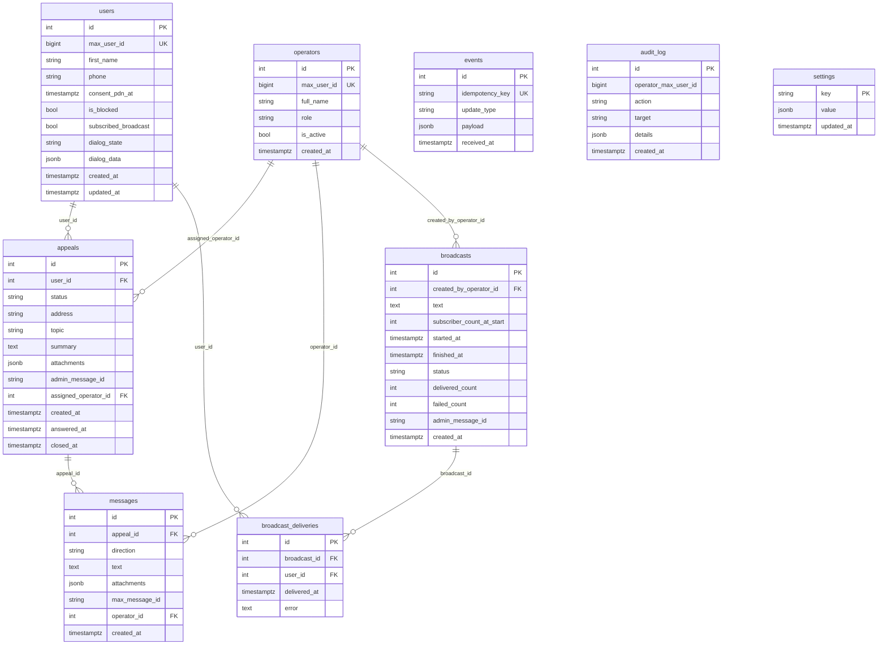

# Схема базы данных

ER-диаграмма ниже сгенерирована вручную из `bot/aemr_bot/db/models.py`. Обновляйте при изменении моделей или миграций.



## Таблицы по назначению

| Таблица | Назначение | Ретенция |
|---|---|---|
| `users` | Житель: профиль, FSM-состояние воронки, флаги `is_blocked` и `subscribed_broadcast` | бессрочно (анонимизация по `/forget` или `/erase`) |
| `operators` | Оператор: `max_user_id`, ФИО, роль, активность | бессрочно |
| `appeals` | Обращение: одно обращение — одна строка `#N` | бессрочно |
| `messages` | История сообщений внутри обращения (житель ↔ оператор) | бессрочно |
| `events` | Лог сырых Update от MAX для идемпотентности и отладки | бессрочно (см. инварианты ниже — авто-чистка не реализована) |
| `audit_log` | Действия операторов (ответ, закрытие, удаление ПДн, изменение настроек) | бессрочно |
| `settings` | Редактируемые из БД параметры (URL, тексты, контакты, тематики) | бессрочно |
| `broadcasts` | Метаданные рассылок: текст, кто отправил, счётчики, статус | бессрочно |
| `broadcast_deliveries` | По одной строке на каждую попытку доставки (житель × рассылка) | бессрочно |

## Ключевые инварианты

- `users.max_user_id` уникален в пределах MAX-платформы. На него опирается весь дедуплицированный поиск жителя при следующем `/start`.
- `events.idempotency_key` уникален — основа защиты от дубликатов Update-ов. Авто-ретеншн пока не реализован; таблица растёт линейно к трафику. На малом масштабе АЕМР это годится; авто-чистку старше N дней оставляем как направление развития (см. [ADR-001 §11](ADR-001-architecture.md)).
- `appeals.admin_message_id` — `mid` текстовой карточки в админ-группе. По нему `handle_operator_reply` находит обращение, на которое отвечает оператор свайпом или `/reply`. NULL до момента отправки карточки в группу.
- `users.dialog_state` хранится как `String(32)`, значения — из `DialogState` enum в коде. Перевод в Postgres `Enum` — одно из возможных направлений развития ([ADR-001 §11](ADR-001-architecture.md)). На MVP сознательно оставлен строкой ради скорости миграций при добавлении состояний.
- `appeals.attachments` и `messages.attachments` — JSONB-массивы с сериализованными MAX-вложениями. Воссоздаются в pydantic-объекты `Attachments` через `TypeAdapter` при пересылке в админ-группу.
- Подписчики рассылки = `users.subscribed_broadcast=true AND users.is_blocked=false`. После `/erase` оба флага переключаются (`subscribed_broadcast=false`, `is_blocked=true`), чтобы жителя нельзя было повторно тронуть рассылкой без нового согласия.
- `broadcasts.subscriber_count_at_start` — снимок количества получателей на момент старта; нужен для прогресс-бара и итогового расчёта `delivered + failed`. Не пересчитывается при ходе рассылки.

## Связь со схемами Alembic

Миграции — в `bot/aemr_bot/db/alembic/versions/` (`0001_initial.py`, `0002_broadcast.py`). Каждое изменение моделей фиксируется новой миграцией; версия в БД проверяется командой `alembic current` внутри контейнера.

```bash
docker compose exec bot alembic current
docker compose exec bot alembic upgrade head
```
