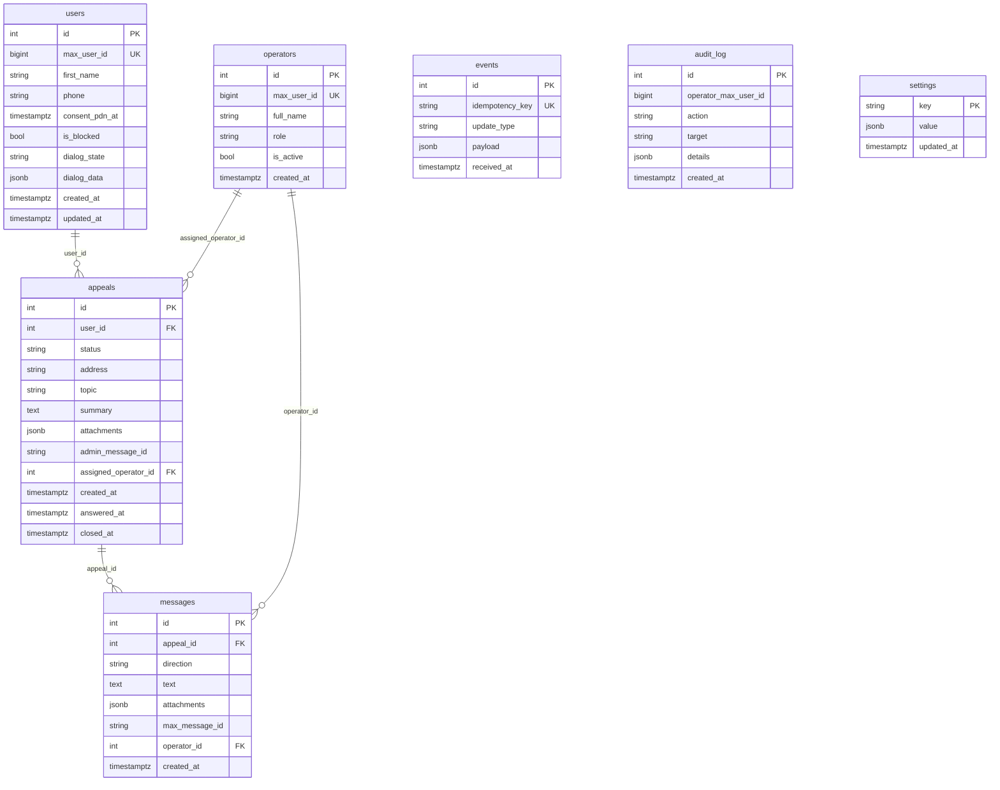

# Схема базы данных

ER-диаграмма ниже сгенерирована вручную из `bot/aemr_bot/db/models.py`. Обновляйте при изменении моделей или миграций.



## Таблицы по назначению

| Таблица | Назначение | Ретенция |
|---|---|---|
| `users` | Житель: профиль + текущее состояние FSM воронки | бессрочно (до `/forget`) |
| `operators` | Оператор: max_user_id, ФИО, роль, активность | бессрочно |
| `appeals` | Обращение: один обращение = одна строка #N | бессрочно |
| `messages` | История сообщений внутри обращения (citizen ↔ operator) | бессрочно |
| `events` | Лог сырых Update от MAX для idempotency и debugging | 30 дней |
| `audit_log` | Действия операторов (ответ, закрытие, удаление ПДн, изменение настроек) | бессрочно |
| `settings` | Редактируемые из БД параметры (URL электронной приёмной, тексты, контакты) | бессрочно |

## Ключевые инварианты

- `users.max_user_id` уникален в пределах MAX-платформы.
- `events.idempotency_key` уникален — основа защиты от дубликатов update'ов от MAX.
- `appeals.admin_message_id` — message_id текстовой карточки в админ-группе. Используется чтобы привязать reply оператора обратно к обращению. NULL до момента отправки карточки в группу.
- `users.dialog_state` хранится как `String(32)`, значения — из `DialogState` enum в коде. Phase D кандидат на миграцию в Postgres `Enum` тип (см. ADR-001 §9).
- `appeals.attachments` и `messages.attachments` — JSONB-массивы с сериализованными MAX-вложениями. Воссоздаются обратно в pydantic-объекты `Attachments` через `TypeAdapter` при пересылке в админ-группу.

## Связь со схемами Alembic

Миграции — в `bot/alembic/versions/`. Каждое изменение моделей фиксируется новой миграцией; версия в БД проверяется командой `alembic current` внутри контейнера.

```bash
docker compose exec bot alembic current
docker compose exec bot alembic upgrade head
```
